# CCECO EXOWELD IEC 型錄整理

> 來源：`docs/CCECO EXOWELD- IEC CATALOG.pdf`（52 頁）  
> 產出：整頁圖擷取 + 接點示意裁切 + Tesseract OCR 規格表  
> **注意**：OCR 可能誤讀數字（如 `115`→`15`、`mm²`→`mm?`）；正式規格／報價請以原 PDF 或業務確認為準。  
> 聯絡：cce@ccelect.com.tw ｜ http://www.ccelect.com.tw

## 目錄

- [公司與產品概要](#公司與產品概要)
- [熱熔接原理與優點](#熱熔接原理與優點)
- [施工步驟](#施工步驟)
- [熔接劑與工具配件](#熔接劑與工具配件)
- [型號編排說明](#型號編排說明)
- [系列一覽](#系列一覽)
  - [W 系列 — 線對線（Wire to Wire）](#series-w)
  - [G 系列 — 接地棒對線（Ground Rod to Wire）](#series-g)
  - [S 系列 — 鋼板／鋼管對線（Steel Sheets & Pipes）](#series-s)
  - [R 系列 — 鋼筋對線（Wire to Rebar）](#series-r)
  - [P 系列 — 線對扁銅排（Cable to Busbar）](#series-p)
  - [B 系列 — 扁銅排連接（Busbar）](#series-b)
  - [E 系列 — 端子（Lugs / Terminals）](#series-e)
  - [C 系列 — 陰極防蝕（Cathodic Protection）](#series-c)
- [應用與其他產品](#應用與其他產品)
- [完整頁面圖片索引](#完整頁面圖片索引)

---

## 公司與產品概要

位於台灣台北的 **CHI CHI Electric Company（集集電工業）**，從事電氣接地連接器製造與工程研發。台灣市場供應電力系統、鐵路、捷運與土木專案；外銷日本、東南亞，並透過 ATI Tectoniks（香港）及澳洲、中國、美國等據點銷售。

**主要產品**：Exoweld／Tectoweld 熱熔接、軌道銲接、Ionic Earthing Array、低電阻回填、接地棒、匯流排與組件。

**型錄宣稱符合**：ISO 9000、UL 467（E305374）、IEEE Std. 837／80／1100、NEC Article 250。

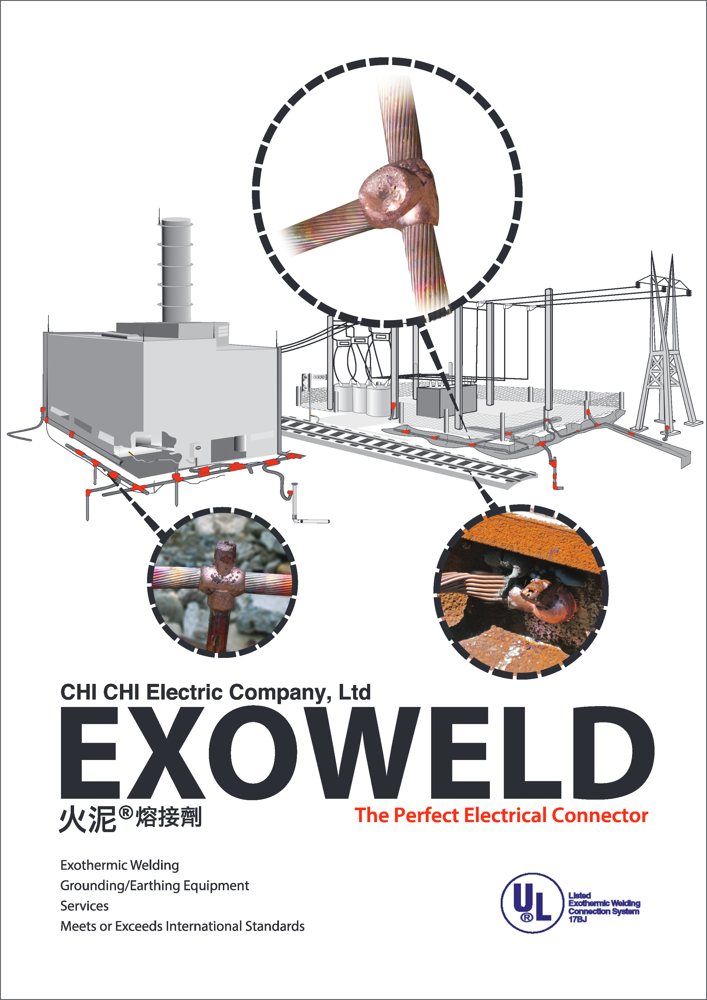

---

## 熱熔接原理與優點

熱熔接在**不需外部電源／熱源**下完成銅對銅或銅對鋼的電氣連接。熔接粉於石墨熔模內點燃後產生熔融金屬流入熔腔，冷卻形成**分子級永久接合**。

**優點**：載流能力等同導體、不鬆脫腐蝕、可承受重複故障、施工簡便可攜、可目視檢查。

適用材質含普通鋼、不鏽鋼、鋼軌、銅包鋼、鑄鐵、青銅、黃銅、矽青銅、鍍鋅等。

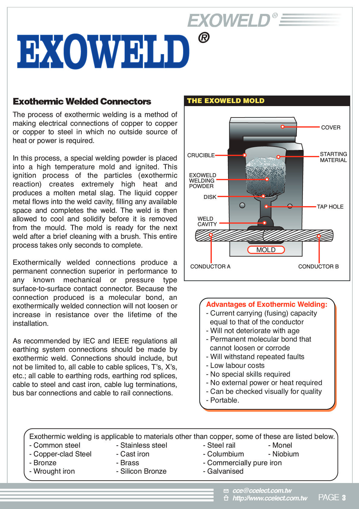

---

## 施工步驟

1. 乾燥熔模與導體  
2. 清潔導體  
3. 放入熔模並鎖定把手  
4. 裝填熔接劑、點火、冷卻、清渣（詳見原 PDF 圖示）

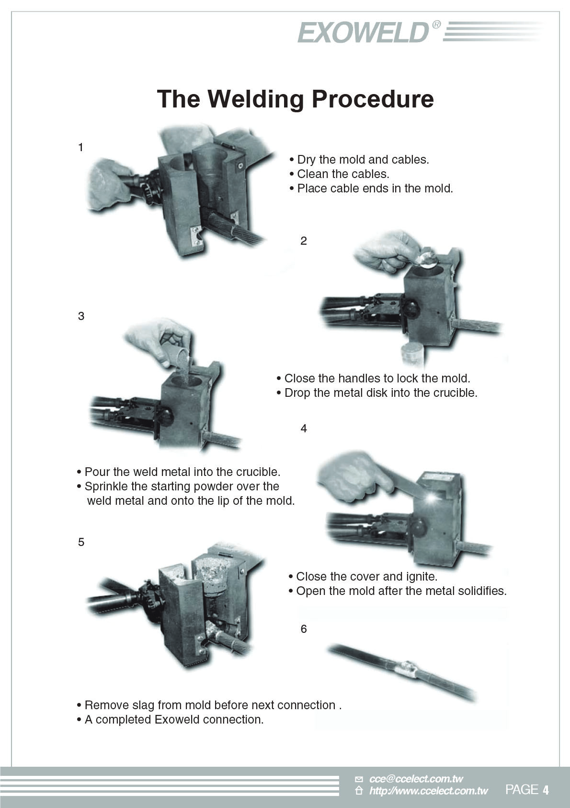

---

## 熔接劑與工具配件

| 項目 | 說明 |
| --- | --- |
| Weld Metal A | 一般銅線／銅排／接地棒 |
| Weld Metal B | 軌道銲接 |
| Weld Metal C | 鑄鐵構件 |
| Weld Metal CP | 陰極防蝕 |
| 熔模選項 `-S` | Split crucible（WT／WX），例 `WT-100/100-S` |
| 熔模選項 `-G` | Wear plate，例 `WT-100/100-G` |
| CL-3 / CL-4 | 熔模把手（依熔模號選用） |
| CLR 系列 | 鐵路用把手 |
| 鍊條把手 | CL-3CV／CH、CL-4CV／CH（管／樑） |
| S-2 / S-3 | 清渣工具 |
| IGNITOR | 打火石點火器 |
| MCB-1 | 熔模刷 |
| CUTTER1 | 棘輪電纜剪 |
| TORCH | 預熱噴槍頭 |
| Tool Kit | 完整施工工具組 |

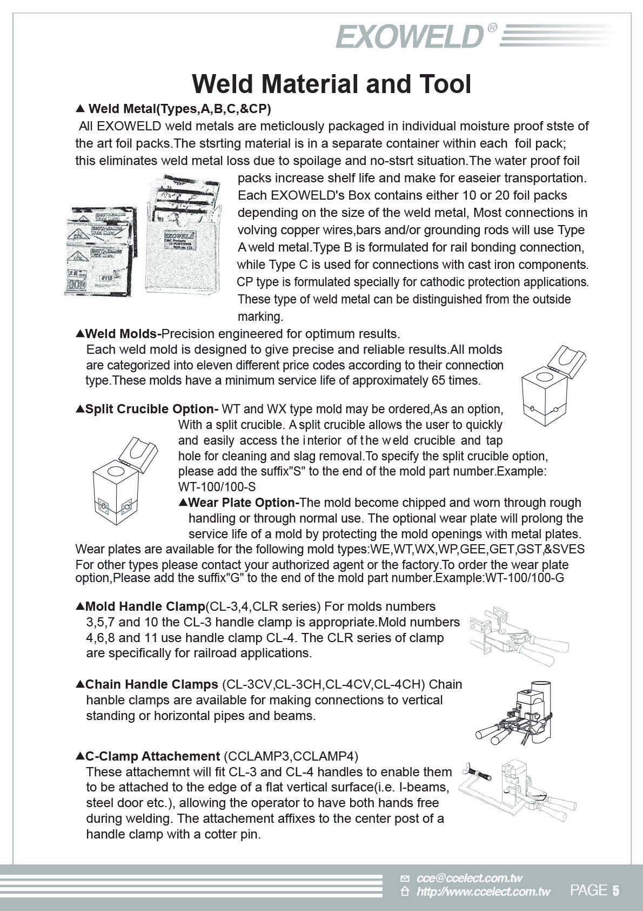
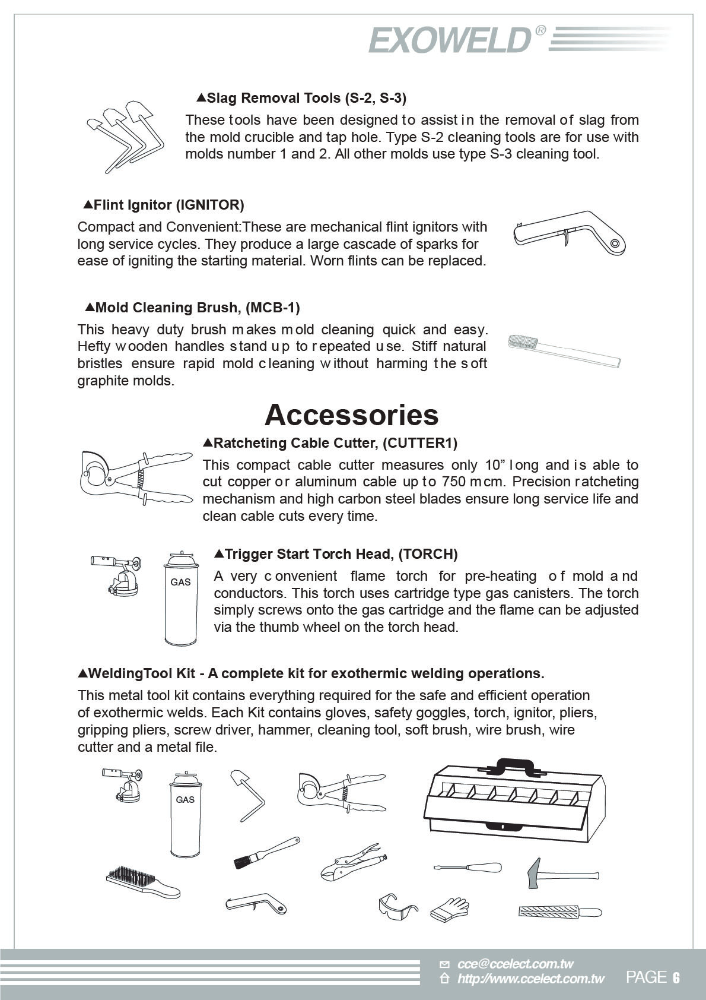

---

## 型號編排說明

範例：Conductor A `95 mm²` + Conductor B `35 mm²` + 形式 `WE` → 熔模 `WE-95/35`。

表格欄位通常為：**Conductor A/B**、**Mold Type**、**Price Code**、**Weld Metal**（必要時含 DX-3）。

| 系列 | 接點形式 |
| --- | --- |
| **W** Wire to Wire | WE/WES, WT, WF, WX/WXS, WL, WXL, WP |
| **G** Ground Rod to Wire | GBN, GES, GTS, GBT, GET, GVE, GEP, GEY, GEE, GST |
| **S** Steel Sheets & Pipes | SHEA, SHEB, SHTA, SHTB, SVED, SVEH, SVES, SVEU, SVTV, SVTHA, SVTHB |
| **R** Wire to Rebar | RVXH, RHXH, RHEH |

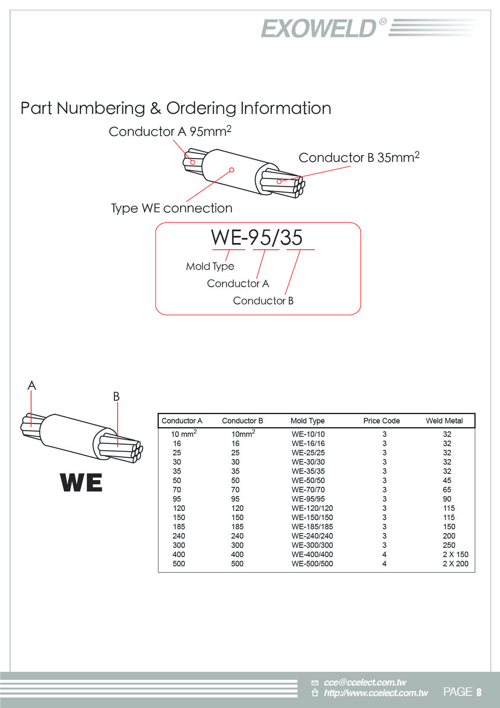

---

## 系列一覽


<a id="series-w"></a>

## W 系列 — 線對線（Wire to Wire）

銅導體對銅導體：直通、T、交叉、平行、L 等。

### WE — 線對線直通

Wire-to-wire through / splice

- 型錄頁：PAGE 8
- 整頁圖：[](pages/page-08.png)
- 示意圖：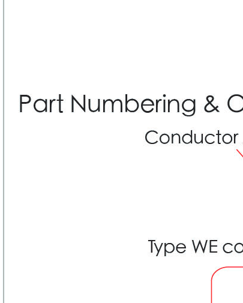

| 熔模型號 Mold Type | Price Code | Weld Metal | 配件 |
| --- | --- | --- | --- |
| `WE-10/10` | 3 | 32 | — |
| `WE-16/16` | 3 | 32 | — |
| `WE-25/25` | 3 | 32 | — |
| `WE-30/30` | 3 | 32 | — |
| `WE-35/35` | 3 | 32 | — |
| `WE-50/50` | 3 | 45 | — |
| `WE-70/70` | 3 | 65 | — |
| `WE-95/95` | 3 | 90 | — |
| `WE-120/120` | 3 | 115 | — |
| `WE-150/150` | 3 | 115 | — |
| `WE-185/185` | 3 | 150 | — |
| `WE-240/240` | 3 | 200 | — |
| `WE-300/300` | 3 | 250 | — |
| `WE-400/400` | 4 | 2X 150 | — |
| `WE-500/500` | 4 | 2X 200 | — |


### WT — 線對線 T 接

Wire-to-wire T connection

- 型錄頁：PAGE 9（相關頁：5, 9, 11, 47）
- 整頁圖：[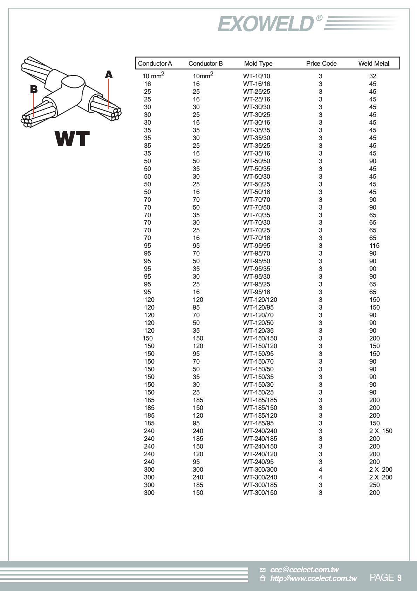](pages/page-09.png)
- 示意圖：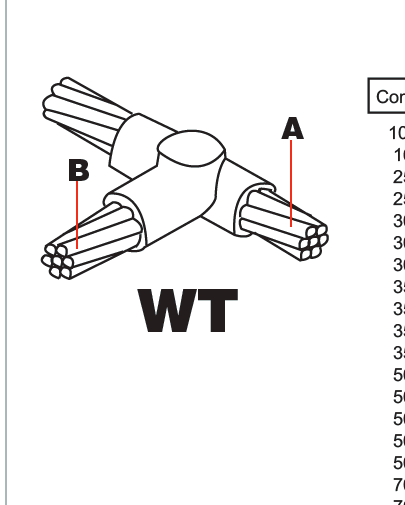

| 熔模型號 Mold Type | Price Code | Weld Metal | 配件 |
| --- | --- | --- | --- |
| `WT-10/10` | 3 | 32 | — |
| `WT-16/16` | 3 | 45 | — |
| `WT-25/25` | 3 | 45 | — |
| `WT-25/16` | 3 | 45 | — |
| `WT-30/30` | 3 | 45 | — |
| `WT-30/25` | 3 | 45 | — |
| `WT-30/16` | 3 | 45 | — |
| `WT-35/35` | 3 | 45 | — |
| `WT-35/30` | 3 | 45 | — |
| `WT-35/25` | 3 | 45 | — |
| `WT-35/16` | 3 | 45 | — |
| `WT-50/50` | 3 | 90 | — |
| `WT-50/35` | 3 | 45 | — |
| `WT-50/30` | 3 | 45 | — |
| `WT-50/25` | 3 | 45 | — |
| `WT-50/16` | 3 | 45 | — |
| `WT-70/70` | 3 | 90 | — |
| `WT-70/50` | 3 | 90 | — |
| `WT-70/35` | 3 | 65 | — |
| `WT-70/30` | 3 | 65 | — |
| `WT-70/25` | 3 | 65 | — |
| `WT-70/16` | 3 | 65 | — |
| `WT-95/95` | 3 | 115 | — |
| `WT-95/70` | 3 | 90 | — |
| `WT-95/50` | 3 | 90 | — |
| `WT-95/35` | 3 | 90 | — |
| `WT-95/30` | 3 | 90 | — |
| `WT-95/25` | 3 | 65 | — |
| `WT-95/16` | 3 | 65 | — |
| `WT-120/120` | 3 | 150 | — |
| `WT-120/95` | 3 | 150 | — |
| `WT-120/70` | 3 | 90 | — |
| `WT-120/50` | 3 | 90 | — |
| `WT-120/35` | 3 | 90 | — |
| `WT-150/150` | 3 | 200 | — |
| `WT-150/120` | 3 | 150 | — |
| `WT-150/95` | 3 | 150 | — |
| `WT-150/70` | 3 | 90 | — |
| `WT-150/50` | 3 | 90 | — |
| `WT-150/35` | 3 | 90 | — |
| `WT-150/30` | 3 | 90 | — |
| `WT-150/25` | 3 | 90 | — |
| `WT-185/185` | 3 | 200 | — |
| `WT-185/150` | 3 | 200 | — |
| `WT-185/120` | 3 | 200 | — |
| `WT-185/95` | 3 | 150 | — |
| `WT-240/240` | 3 | 2X 150 | — |
| `WT-240/185` | 3 | 200 | — |
| `WT-240/150` | 3 | 200 | — |
| `WT-240/120` | 3 | 200 | — |
| `WT-240/95` | 3 | 200 | — |
| `WT-300/300` | 4 | 2X 200 | — |
| `WT-300/240` | 4 | 2X 200 | — |
| `WT-300/185` | 3 | 250 | — |
| `WT-300/150` | 3 | 200 | — |
| `WT-120/30` | 3 | 90 | — |
| `WT-120/25` | 3 | 90 | — |
| `WT-120116` | 3 | 90 | — |


### WX — 線對線交叉

Wire-to-wire cross (X)

- 型錄頁：PAGE 10（相關頁：10, 11）
- 整頁圖：[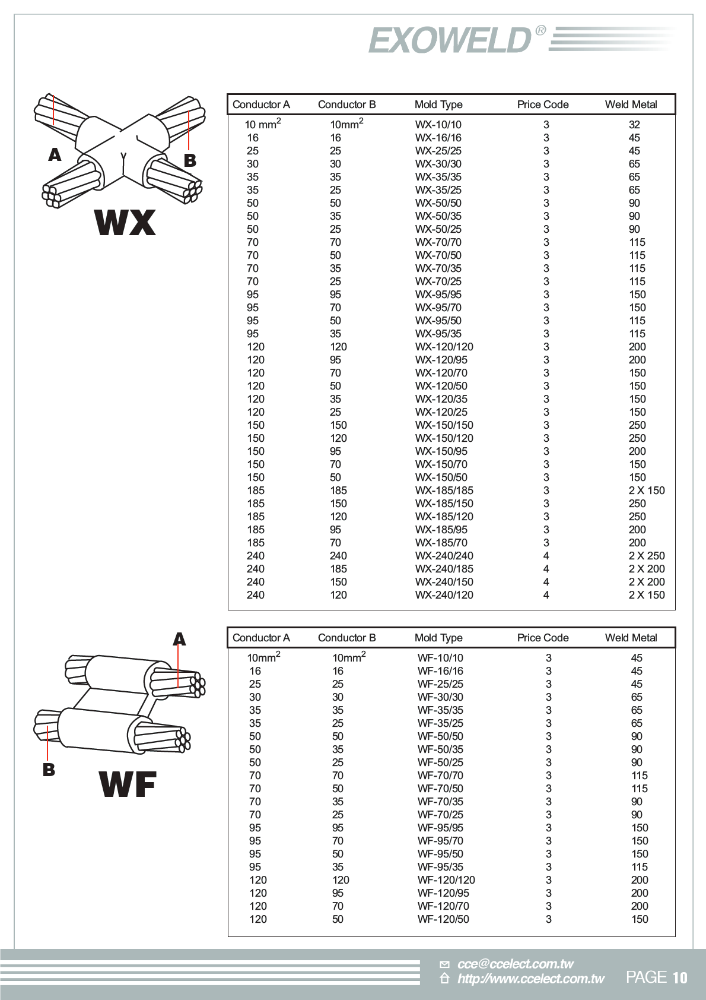](pages/page-10.png)
- 示意圖：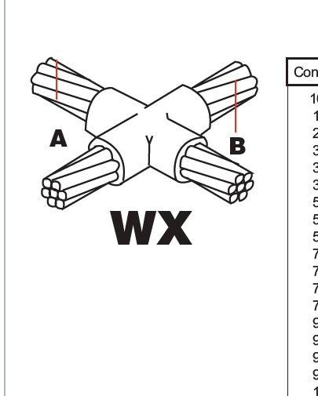

| 熔模型號 Mold Type | Price Code | Weld Metal | 配件 |
| --- | --- | --- | --- |
| `WX-10/10` | 3 | 32 | — |
| `WX-16/16` | 3 | 45 | — |
| `WX-25/25` | 3 | 45 | — |
| `WX-30/30` | 3 | 6 | — |
| `WX-35/35` | 3 | 65 | — |
| `WX-35/25` | 3 | 65 | — |
| `WX-50/50` | 3 | 90 | — |
| `WX-50/35` | 3 | 90 | — |
| `WX-50/25` | 3 | 90 | — |
| `WX-70/70` | 3 | 115 | — |
| `WX-70/50` | 3 | 115 | — |
| `WX-70/35` | 3 | 115 | — |
| `WX-70/25` | 3 | 115 | — |
| `WX-95/95` | 3 | 150 | — |
| `WX-95/70` | 3 | 150 | — |
| `WX-95/50` | 3 | 15 | — |
| `WX-95/35` | 3 | 15 | — |
| `WX-120/120` | 3 | 200 | — |
| `WX-120/95` | 3 | 200 | — |
| `WX-120/70` | 3 | 150 | — |
| `WX-120/50` | 3 | 150 | — |
| `WX-120/35` | 3 | 150 | — |
| `WX-120/25` | 3 | 150 | — |
| `WX-150/150` | 3 | 250 | — |
| `WX-150/120` | 3 | 250 | — |
| `WX-150/95` | 3 | 200 | — |
| `WX-150/70` | 3 | 150 | — |
| `WX-150/50` | 3 | 150 | — |
| `WX-185/185` | 3 | 2X 150 | — |
| `WX-185/150` | 3 | 250 | — |
| `WX-185/120` | 3 | 250 | — |
| `WX-185/95` | 3 | 200 | — |
| `WX-185/70` | 3 | 200 | — |
| `WX-240/240` | 4 | 2X 250 | — |
| `WX-240/185` | 4 | 2X 200 | — |
| `WX-240/150` | 4 | 2X 200 | — |
| `WX-240/120` | 4 | 2X 150 | — |
| `WX-240/95` | 4 | 250 | — |


### WF — 線對線平行

Wire-to-wire parallel

- 型錄頁：PAGE 10
- 整頁圖：[](pages/page-10.png)
- 示意圖：

| 熔模型號 Mold Type | Price Code | Weld Metal | 配件 |
| --- | --- | --- | --- |
| `WF-10/10` | 3 | 45 | — |
| `WF-16/16` | 3 | 45 | — |
| `WF-25/25` | 3 | 45 | — |
| `WF-30/30` | 3 | 65 | — |
| `WF-35/35` | 3 | 65 | — |
| `WF-35/25` | 3 | 65 | — |
| `WF-50/50` | 3 | 90 | — |
| `WF-50/35` | 3 | 90 | — |
| `WF-50/25` | 3 | 90 | — |
| `WF-70/70` | 3 | 115 | — |
| `WF-70/50` | 3 | 115 | — |
| `WF-70/35` | 3 | 90 | — |
| `WF-70/25` | 3 | 90 | — |
| `WF-95/95` | 3 | 150 | — |
| `WF-95/70` | 3 | 150 | — |
| `WF-95/50` | 3 | 150 | — |
| `WF-95/35` | 3 | 15 | — |
| `WF-120/120` | 3 | 200 | — |
| `WF-120/95` | 3 | 200 | — |
| `WF-120/70` | 3 | 200 | — |
| `WF-120/50` | 3 | 150 | — |


### WP — 線對線垂直搭接

Wire-to-wire parallel/vertical tap

- 型錄頁：PAGE 11
- 整頁圖：[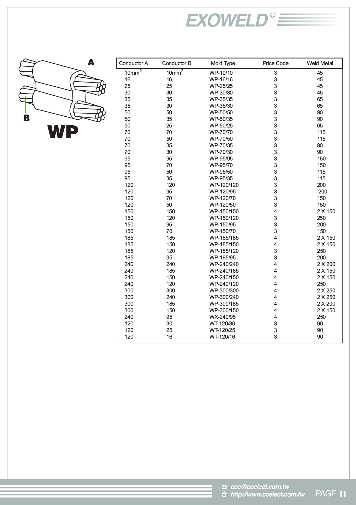](pages/page-11.png)
- 示意圖：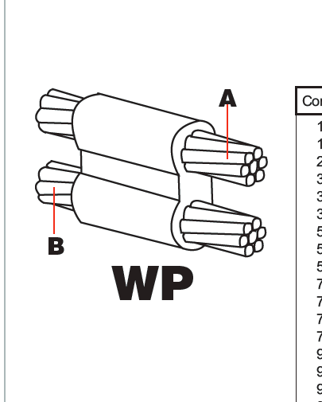

| 熔模型號 Mold Type | Price Code | Weld Metal | 配件 |
| --- | --- | --- | --- |
| `WP-10/10` | 3 | 45 | — |
| `WP-16/16` | 3 | 45 | — |
| `WP-25/25` | 3 | 45 | — |
| `WP-30/30` | 3 | 45 | — |
| `WP-35/35` | 3 | 65 | — |
| `WP-35/30` | 3 | 65 | — |
| `WP-50/50` | 3 | 90 | — |
| `WP-50/35` | 3 | 20 | — |
| `WP-50/25` | 3 | 65 | — |
| `WP-70/50` | 3 | 15 | — |
| `WP-70/35` | 3 | 90 | — |
| `WP-70/30` | 3 | 90 | — |
| `WP-95/95` | 3 | 150 | — |
| `WP-95/50` | 3 | 15 | — |
| `WP-95/35` | 3 | 15 | — |
| `WP-120/120` | 3 | 200 | — |
| `WP-120/95` | 3 | 200 | — |
| `WP-120/70` | 3 | 150 | — |
| `WP-120/50` | 3 | 150 | — |
| `WP-150/150` | 4 | 2X 150 | — |
| `WP-150/120` | 3 | 250 | — |
| `WP-150/95` | 3 | 200 | — |
| `WP-150/70` | 3 | 150 | — |
| `WP-185/185` | 4 | 2X 150 | — |
| `WP-185/150` | 4 | 2X 150 | — |
| `WP-185/120` | 3 | 250 | — |
| `WP-185/95` | 3 | 200 | — |
| `WP-240/240` | 4 | 2X 200 | — |
| `WP-240/185` | 4 | 2X 150 | — |
| `WP-240/150` | 4 | 2X 150 | — |
| `WP-240/120` | 4 | 250 | — |
| `WP-300/300` | 4 | 2X 250 | — |
| `WP-300/240` | 4 | 2X 250 | — |
| `WP-300/185` | 4 | 2X 200 | — |
| `WP-300/150` | 4 | 2X 150 | — |


### WL — 線對線 L 接

Wire-to-wire L

- 型錄頁：PAGE 12
- 整頁圖：[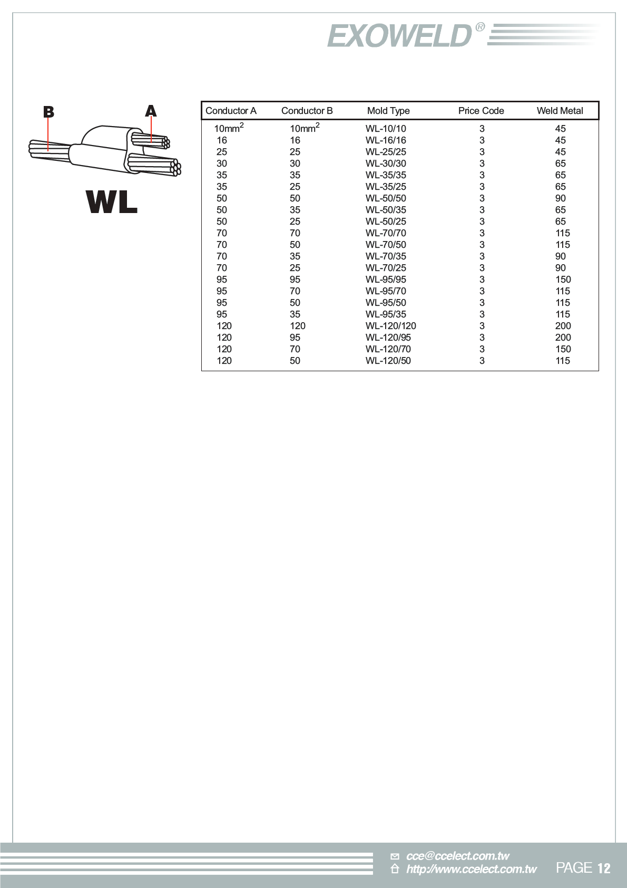](pages/page-12.png)
- 示意圖：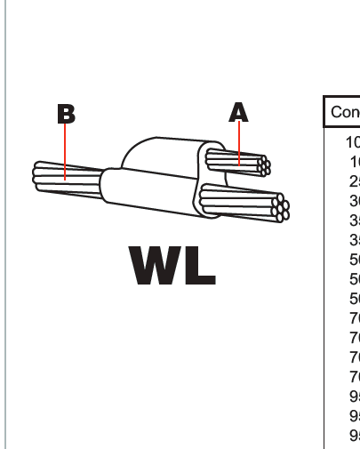

| 熔模型號 Mold Type | Price Code | Weld Metal | 配件 |
| --- | --- | --- | --- |
| `WL-10/10` | 3 | 45 | — |
| `WL-16/16` | 3 | 45 | — |
| `WL-25/25` | 3 | 45 | — |
| `WL-30/30` | 3 | 65 | — |
| `WL-35/35` | 3 | 65 | — |
| `WL-35/25` | 3 | 65 | — |
| `WL-50/50` | 3 | 90 | — |
| `WL-50/35` | 3 | 65 | — |
| `WL-50/25` | 3 | 65 | — |
| `WL-70/70` | 3 | 15 | — |
| `WL-70/50` | 3 | 15 | — |
| `WL-70/35` | 3 | 90 | — |
| `WL-70/25` | 3 | 90 | — |
| `WL-95/95` | 3 | 150 | — |
| `WL-95/70` | 3 | 15 | — |
| `WL-95/50` | 3 | 15 | — |
| `WL-95/35` | 3 | 15 | — |
| `WL-120/120` | 3 | 200 | — |
| `WL-120/95` | 3 | 200 | — |
| `WL-120/70` | 3 | 150 | — |
| `WL-120/50` | 3 | 15 | — |


### WXL — 線對線 XL 接

Wire-to-wire XL

- 型錄頁：PAGE 13
- 整頁圖：[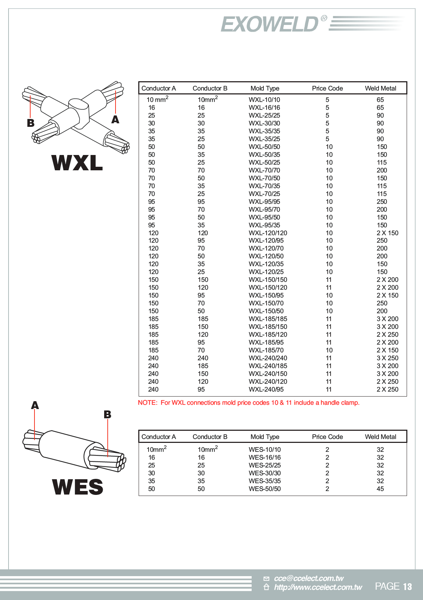](pages/page-13.png)
- 示意圖：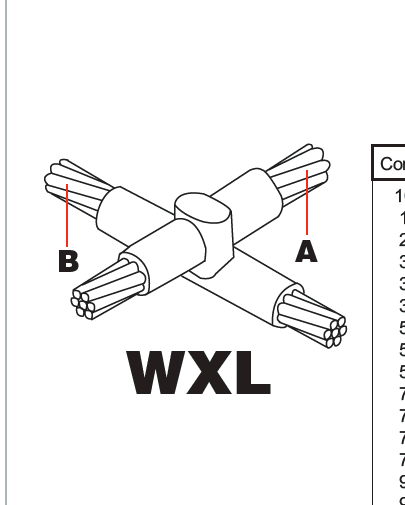

| 熔模型號 Mold Type | Price Code | Weld Metal | 配件 |
| --- | --- | --- | --- |
| `WXL-10/10` | 5 | 65 | — |
| `WXL-16/16` | 5 | 65 | — |
| `WXL-25/25` | 5 | 90 | — |
| `WXL-30/30` | 5 | 90 | — |
| `WXL-35/35` | 5 | 90 | — |
| `WXL-35/25` | 5 | 90 | — |
| `WXL-50/50` | 10 | 150 | — |
| `WXL-50/35` | 10 | 150 | — |
| `WXL-50/25` | 10 | 15 | — |
| `WXL-70/70` | 10 | 200 | — |
| `WXL-70/50` | 10 | 150 | — |
| `WXL-70/35` | 10 | 15 | — |
| `WXL-70/25` | 10 | 15 | — |
| `WXL-95/95` | 10 | 250 | — |
| `WXL-95/70` | 10 | 200 | — |
| `WXL-95/50` | 10 | 150 | — |
| `WXL-95/35` | 10 | 150 | — |
| `WXL-120/120` | 10 | 2X 150 | — |
| `WXL-120/95` | 10 | 250 | — |
| `WXL-120/70` | 10 | 200 | — |
| `WXL-120/50` | 10 | 200 | — |
| `WXL-120/35` | 10 | 150 | — |
| `WXL-120/25` | 10 | 150 | — |
| `WXL-150/95` | 10 | 2X 150 | — |
| `WXL-150/70` | 10 | 250 | — |
| `WXL-150/50` | 10 | 200 | — |
| `WXL-185/70` | 10 | 2X 150 | — |


### WES — 線對線直通（小型）

Wire-to-wire splice compact

- 型錄頁：PAGE 13
- 整頁圖：[](pages/page-13.png)
- 示意圖：

| 熔模型號 Mold Type | Price Code | Weld Metal | 配件 |
| --- | --- | --- | --- |
| `WES-10/10` | 2 | 32 | — |
| `WES-16/16` | 2 | 32 | — |
| `WES-25/25` | 2 | 32 | — |
| `WES-30/30` | 2 | 32 | — |
| `WES-35/35` | 2 | 32 | — |
| `WES-50/50` | 2 | 45 | — |


### WTS — 線對線 T（小型）

Wire-to-wire T compact

- 型錄頁：PAGE 14
- 整頁圖：[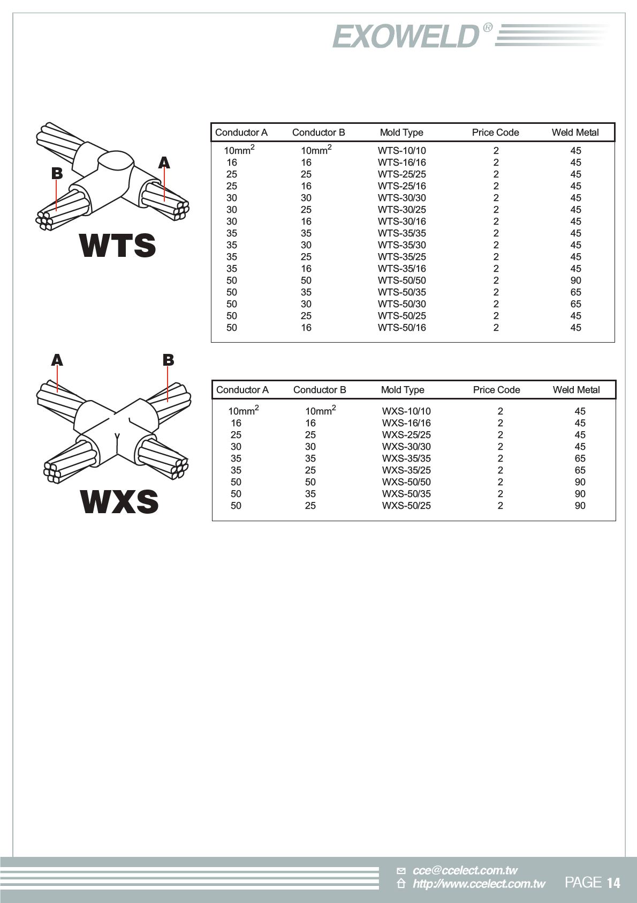](pages/page-14.png)
- 示意圖：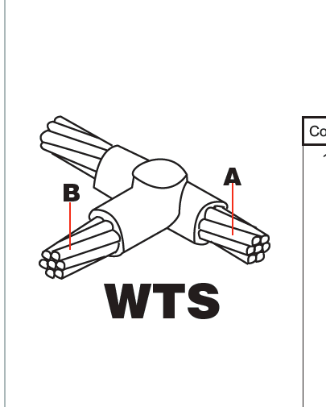

| 熔模型號 Mold Type | Price Code | Weld Metal | 配件 |
| --- | --- | --- | --- |
| `WTS-10/10` | 2 | 45 | — |
| `WTS-16/16` | 2 | 45 | — |
| `WTS-25/25` | 2 | 45 | — |
| `WTS-25/16` | 2 | 45 | — |
| `WTS-30/30` | 2 | 45 | — |
| `WTS-30/25` | 2 | 45 | — |
| `WTS-30/16` | 2 | 45 | — |
| `WTS-35/35` | 2 | 45 | — |
| `WTS-35/30` | 2 | 45 | — |
| `WTS-35/25` | 2 | 45 | — |
| `WTS-35/16` | 2 | 45 | — |
| `WTS-50/50` | 2 | 90 | — |
| `WTS-50/35` | 2 | 65 | — |
| `WTS-50/30` | 2 | 65 | — |
| `WTS-50/25` | 2 | 45 | — |
| `WTS-50/16` | 2 | 45 | — |


<a id="series-g"></a>

## G 系列 — 接地棒對線（Ground Rod to Wire）

接地棒（常見 1/2"、5/8"、3/4"）與銅導體／扁銅排。

### GEE — 接地棒對線直通

Ground rod to wire end/run

- 型錄頁：PAGE 15（相關頁：15, 47）
- 整頁圖：[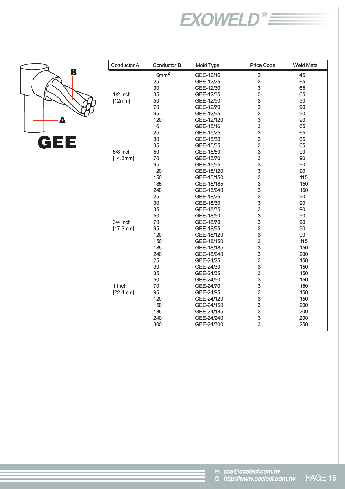](pages/page-15.png)
- 示意圖：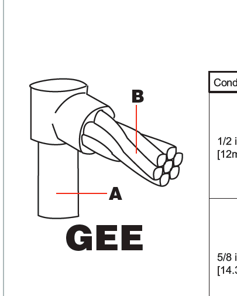

| 熔模型號 Mold Type | Price Code | Weld Metal | 配件 |
| --- | --- | --- | --- |
| `GEE-12/16` | 3 | 45 | — |
| `GEE-12/25` | 3 | 65 | — |
| `GEE-12/30` | 3 | 65 | — |
| `GEE-12/35` | 3 | 65 | — |
| `GEE-12/50` | 3 | 90 | — |
| `GEE-12/70` | 3 | 90 | — |
| `GEE-12/95` | 3 | 90 | — |
| `GEE-12/120` | 3 | 90 | — |
| `GEE-15/16` | 3 | 65 | — |
| `GEE-15/25` | 3 | 65 | — |
| `GEE-15/30` | 3 | 65 | — |
| `GEE-15/35` | 3 | 65 | — |
| `GEE-15/50` | 3 | 90 | — |
| `GEE-15/70` | 3 | 90 | — |
| `GEE-15/95` | 3 | 90 | — |
| `GEE-15/120` | 3 | 90 | — |
| `GEE-15/150` | 3 | 15 | — |
| `GEE-15/185` | 3 | 150 | — |
| `GEE-15/240` | 3 | 150 | — |
| `GEE-18/25` | 3 | 90 | — |
| `GEE-18/30` | 3 | 90 | — |
| `GEE-18/35` | 3 | 90 | — |
| `GEE-18/50` | 3 | 90 | — |
| `GEE-18/70` | 3 | 90 | — |
| `GEE-18/95` | 3 | 90 | — |
| `GEE-18/120` | 3 | 90 | — |
| `GEE-18/150` | 3 | 15 | — |
| `GEE-18/185` | 3 | 150 | — |
| `GEE-18/240` | 3 | 200 | — |
| `GEE-24/25` | 3 | 150 | — |
| `GEE-24/30` | 3 | 150 | — |
| `GEE-24/35` | 3 | 150 | — |
| `GEE-24/50` | 3 | 150 | — |
| `GEE-24/70` | 3 | 150 | — |
| `GEE-24995` | 3 | 150 | — |
| `GEE-24/120` | 3 | 150 | — |
| `GEE-24/150` | 3 | 200 | — |
| `GEE-24/185` | 3 | 200 | — |
| `GEE-24/240` | 3 | 200 | — |
| `GEE-24/300` | 3 | 250 | — |


### GET — 接地棒對線 T 接

Ground rod to wire T

- 型錄頁：PAGE 16（相關頁：16, 47）
- 整頁圖：[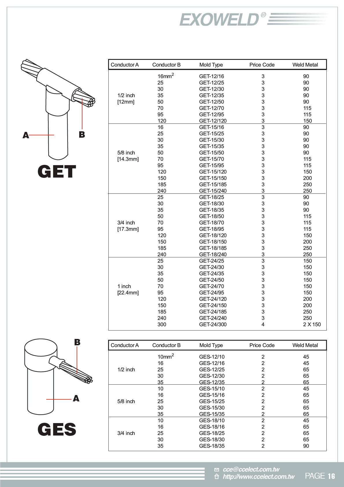](pages/page-16.png)
- 示意圖：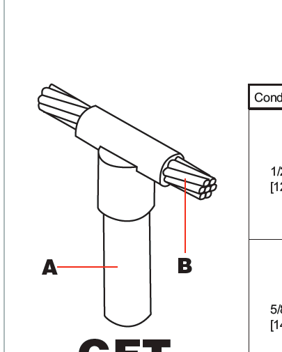

| 熔模型號 Mold Type | Price Code | Weld Metal | 配件 |
| --- | --- | --- | --- |
| `GET-12/16` | 3 | 90 | — |
| `GET-12/25` | 3 | 90 | — |
| `GET-12/30` | 3 | 90 | — |
| `GET-12/35` | 3 | 90 | — |
| `GET-12/50` | 3 | 90 | — |
| `GET-12/70` | 3 | 15 | — |
| `GET-12/95` | 3 | 15 | — |
| `GET-12/120` | 3 | 150 | — |
| `GET-15/16` | 3 | 90 | — |
| `GET-15/25` | 3 | 90 | — |
| `GET-15/30` | 3 | 90 | — |
| `GET-15/35` | 3 | 90 | — |
| `GET-15/50` | 3 | 90 | — |
| `GET-15/70` | 3 | 115 | — |
| `GET-15/95` | 3 | 15 | — |
| `GET-15/120` | 3 | 150 | — |
| `GET-15/150` | 3 | 200 | — |
| `GET-15/185` | 3 | 250 | — |
| `GET-15/240` | 3 | 250 | — |
| `GET-18/25` | 3 | 90 | — |
| `GET-18/30` | 3 | 90 | — |
| `GET-18/35` | 3 | 90 | — |
| `GET-18/50` | 3 | 15 | — |
| `GET-18/70` | 3 | 15 | — |
| `GET-18/95` | 3 | 115 | — |
| `GET-18/120` | 3 | 150 | — |
| `GET-18/150` | 3 | 200 | — |
| `GET-18/185` | 3 | 250 | — |
| `GET-18/240` | 3 | 250 | — |
| `GET-24/25` | 3 | 150 | — |
| `GET-24/30` | 3 | 150 | — |
| `GET-24/35` | 3 | 150 | — |
| `GET-24/50` | 3 | 150 | — |
| `GET-24/70` | 3 | 150 | — |
| `GET-24/95` | 3 | 150 | — |
| `GET-24/120` | 3 | 200 | — |
| `GET-24/150` | 3 | 200 | — |
| `GET-24/185` | 3 | 250 | — |
| `GET-24/240` | 3 | 250 | — |
| `GET-24/300` | 4 | 2X150 | — |


### GES — 接地棒對線側接

Ground rod to wire side

- 型錄頁：PAGE 16
- 整頁圖：[](pages/page-16.png)
- 示意圖：

| 熔模型號 Mold Type | Price Code | Weld Metal | 配件 |
| --- | --- | --- | --- |
| `GES-12/10` | 2 | 45 | — |
| `GES-12/16` | 2 | 45 | — |
| `GES-12/25` | 2 | 65 | — |
| `GES-12/30` | 2 | 65 | — |
| `GES-15/10` | 2 | 45 | — |
| `GES-15/16` | 2 | 65 | — |
| `GES-15/25` | 2 | 65 | — |
| `GES-15/30` | 2 | 65 | — |
| `GES-15/35` | 2 | 65 | — |
| `GES-18/10` | 2 | 45 | — |
| `GES-18/16` | 2 | 65 | — |
| `GES-18/25` | 2 | 65 | — |
| `GES-18/30` | 2 | 65 | — |
| `GES-18/35` | 2 | 90 | — |


### GST — 接地棒對線斜 T

Ground rod to wire angled T

- 型錄頁：PAGE 17
- 整頁圖：[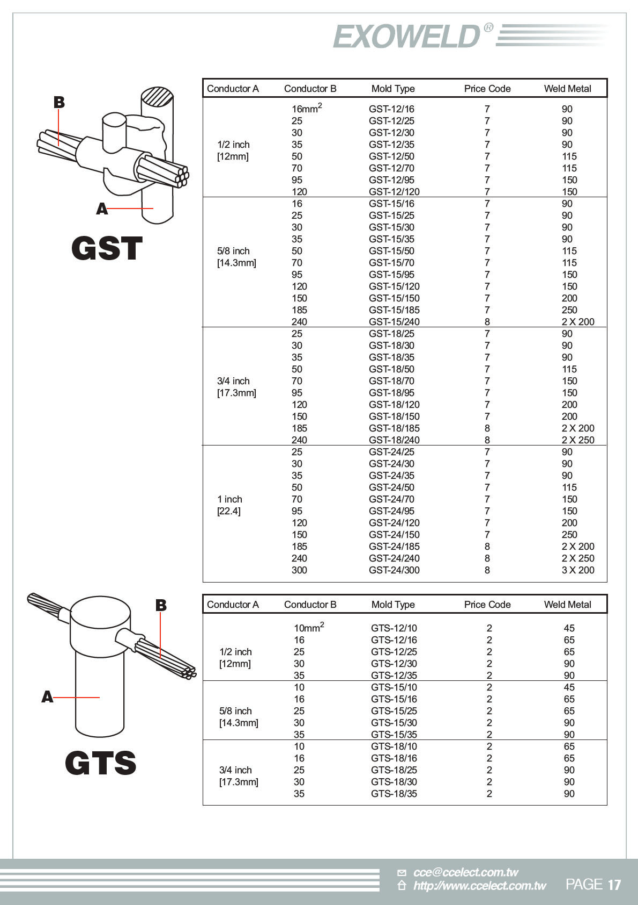](pages/page-17.png)
- 示意圖：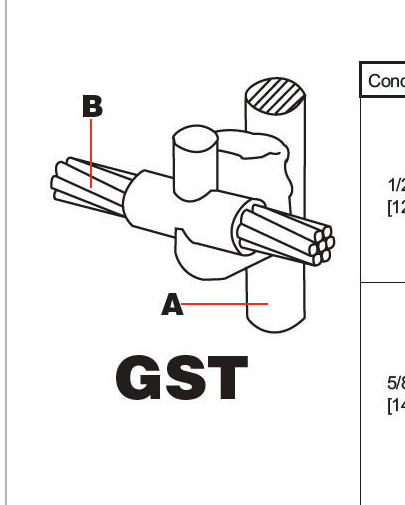

| 熔模型號 Mold Type | Price Code | Weld Metal | 配件 |
| --- | --- | --- | --- |
| `GST-12/16` | 7 | 90 | — |
| `GST-12/25` | 7 | 90 | — |
| `GST-12/30` | 7 | 90 | — |
| `GST-12/35` | 7 | 90 | — |
| `GST-12/50` | 7 | 15 | — |
| `GST-12/70` | 7 | 15 | — |
| `GST-12/95` | 7 | 150 | — |
| `GST-15/16` | 7 | 90 | — |
| `GST-15/25` | 7 | 90 | — |
| `GST-15/30` | 7 | 90 | — |
| `GST-15/35` | 7 | 90 | — |
| `GST-15/50` | 7 | 15 | — |
| `GST-15/70` | 7 | 15 | — |
| `GST-15/95` | 7 | 150 | — |
| `GST-15/150` | 7 | 200 | — |
| `GST-15/185` | 7 | 250 | — |
| `GST-15/240` | 8 | 2X 200 | — |
| `GST-18/25` | 7 | 90 | — |
| `GST-18/30` | 7 | 90 | — |
| `GST-18/35` | 7 | 90 | — |
| `GST-18/50` | 7 | 15 | — |
| `GST-18/95` | 7 | 150 | — |
| `GST-18/120` | 7 | 200 | — |
| `GST-18/150` | 7 | 200 | — |
| `GST-18/185` | 8 | 2X 200 | — |
| `GST-18/240` | 8 | 2X 250 | — |
| `GST-24/25` | 7 | 90 | — |
| `GST-24/30` | 7 | 90 | — |
| `GST-24/35` | 7 | 90 | — |
| `GST-24/50` | 7 | 15 | — |
| `GST-24/70` | 7 | 150 | — |
| `GST-24/95` | 7 | 150 | — |
| `GST-24/150` | 7 | 250 | — |
| `GST-24/185` | 8 | 2X 200 | — |
| `GST-24/240` | 8 | 2X 250 | — |
| `GST-24/300` | 8 | 3X 200 | — |


### GTS — 接地棒對線搭接

Ground rod to wire tap

- 型錄頁：PAGE 17
- 整頁圖：[](pages/page-17.png)
- 示意圖：

| 熔模型號 Mold Type | Price Code | Weld Metal | 配件 |
| --- | --- | --- | --- |
| `GTS-12/10` | 2 | 45 | — |
| `GTS-12/16` | 2 | 65 | — |
| `GTS-12/25` | 2 | 65 | — |
| `GTS-12/30` | 2 | 90 | — |
| `GTS-12/35` | 2 | 90 | — |
| `GTS-15/10` | 2 | 45 | — |
| `GTS-15/16` | 2 | 65 | — |
| `GTS-15/25` | 2 | 65 | — |
| `GTS-15/30` | 2 | 90 | — |
| `GTS-15/35` | 2 | 90 | — |
| `GTS-18/10` | 2 | 65 | — |
| `GTS-18/16` | 2 | 65 | — |
| `GTS-18/25` | 2 | 90 | — |
| `GTS-18/30` | 2 | 90 | — |
| `GTS-18/35` | 2 | 90 | — |


### GEY — 接地棒對線 Y 接

Ground rod to wire Y

- 型錄頁：PAGE 18
- 整頁圖：[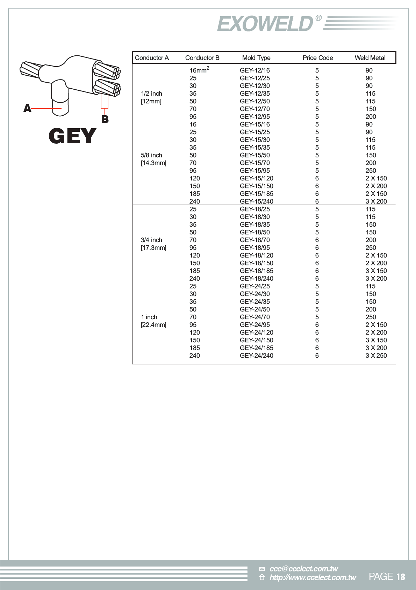](pages/page-18.png)
- 示意圖：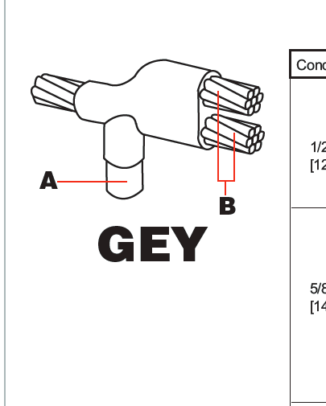

| 熔模型號 Mold Type | Price Code | Weld Metal | 配件 |
| --- | --- | --- | --- |
| `GEY-12/16` | 5 | 90 | — |
| `GEY-12/25` | 5 | 90 | — |
| `GEY-12/30` | 5 | 90 | — |
| `GEY-12/35` | 5 | 115 | — |
| `GEY-12/50` | 5 | 115 | — |
| `GEY-12/70` | 5 | 150 | — |
| `GEY-12/95.` | 5 | 200 | — |
| `GEY-15/16` | 5 | 90 | — |
| `GEY-15/25` | 5 | 90 | — |
| `GEY-15/30` | 5 | 115 | — |
| `GEY-15/35` | 5 | 115 | — |
| `GEY-15/50` | 5 | 150 | — |
| `GEY-15/70` | 5 | 200 | — |
| `GEY-15/95` | 5 | 250 | — |
| `GEY-15/120` | 6 | 2X 150 | — |
| `GEY-15/150` | 6 | 2X200 | — |
| `GEY-15/185` | 6 | 2X 150 | — |
| `GEY-15/240` | 6 | 3X 200 | — |
| `GEY-18/25` | 5 | 115 | — |
| `GEY-18/30` | 5 | 115 | — |
| `GEY-18/35` | 5 | 150 | — |
| `GEY-18/50` | 5 | 150 | — |
| `GEY-18/70` | 6 | 200 | — |
| `GEY-18/95` | 6 | 250 | — |
| `GEY-18/120` | 6 | 2X 150 | — |
| `GEY-18/150` | 6 | 2X 200 | — |
| `GEY-18/185` | 6 | 3X 150 | — |
| `GEY-18/240` | 6 | 3X 200 | — |
| `GEY-24/25` | 5 | 115 | — |
| `GEY-24/30` | 5 | 150 | — |
| `GEY-24/35` | 5 | 150 | — |
| `GEY-24/50` | 5 | 200 | — |
| `GEY-24/70` | 5 | 250 | — |
| `GEY-24/95` | 6 | 2X 150 | — |
| `GEY-24/120` | 6 | 2X 200 | — |
| `GEY-24/150` | 6 | 3X 150 | — |
| `GEY-24/185` | 6 | 3X 200 | — |
| `GEY-24/240` | 6 | 3X 250 | — |


### GEP — 接地棒對線平行

Ground rod to wire parallel

- 型錄頁：PAGE 19
- 整頁圖：[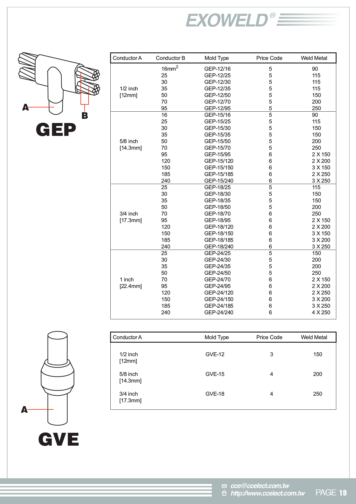](pages/page-19.png)
- 示意圖：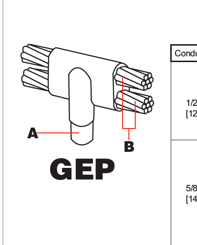

| 熔模型號 Mold Type | Price Code | Weld Metal | 配件 |
| --- | --- | --- | --- |
| `GEP-12/16` | 5 | 90 | — |
| `GEP-12/25` | 5 | 115 | — |
| `GEP-12/30` | 5 | 15 | — |
| `GEP-12/35` | 5 | 15 | — |
| `GEP-12/50` | 5 | 150 | — |
| `GEP-12/70` | 5 | 200 | — |
| `GEP-12/95` | 5 | 250 | — |
| `GEP-15/16` | 5 | 90 | — |
| `GEP-15/25` | 5 | 15 | — |
| `GEP-15/30` | 5 | 150 | — |
| `GEP-15/35` | 5 | 150 | — |
| `GEP-15/50` | 5 | 200 | — |
| `GEP-15/70` | 5 | 250 | — |
| `GEP-15/95` | 6 | 2X150 | — |
| `GEP-15/120` | 6 | 2X200 | — |
| `GEP-15/150` | 6 | 3X 150 | — |
| `GEP-15/185` | 6 | 2X250 | — |
| `GEP-15/240` | 6 | 3X 250 | — |
| `GEP-18/25` | 5 | 15 | — |
| `GEP-18/30` | 5 | 150 | — |
| `GEP-18/35` | 5 | 150 | — |
| `GEP-18/50` | 5 | 200 | — |
| `GEP-18/70` | 6 | 250 | — |
| `GEP-18/95` | 6 | 2X150 | — |
| `GEP-18/120` | 6 | 2X200 | — |
| `GEP-18/150` | 6 | 3X 150 | — |
| `GEP-18/185` | 6 | 3X200 | — |
| `GEP-18/240` | 6 | 3X 250 | — |
| `GEP-24/25` | 5 | 150 | — |
| `GEP-24/30` | 5 | 200 | — |
| `GEP-24/35` | 5 | 200 | — |
| `GEP-24/50` | 5 | 250 | — |
| `GEP-24/70` | 6 | 2X150 | — |
| `GEP-24/95` | 6 | 2X200 | — |
| `GEP-24/120` | 6 | 2X250 | — |
| `GEP-24/150` | 6 | 3X 200 | — |
| `GEP-24/185` | 6 | 3X 250 | — |
| `GEP-24/240` | 6 | 4X 250 | — |


### GVE — 接地棒接續

Ground rod splice

- 型錄頁：PAGE 19
- 整頁圖：[](pages/page-19.png)
- 示意圖：

| 熔模型號 Mold Type | Price Code | Weld Metal | 配件 |
| --- | --- | --- | --- |
| `GVE-15` | 4 | 200 | — |


### GBN — 接地棒對扁銅排

Ground rod to busbar

- 型錄頁：PAGE 20
- 整頁圖：[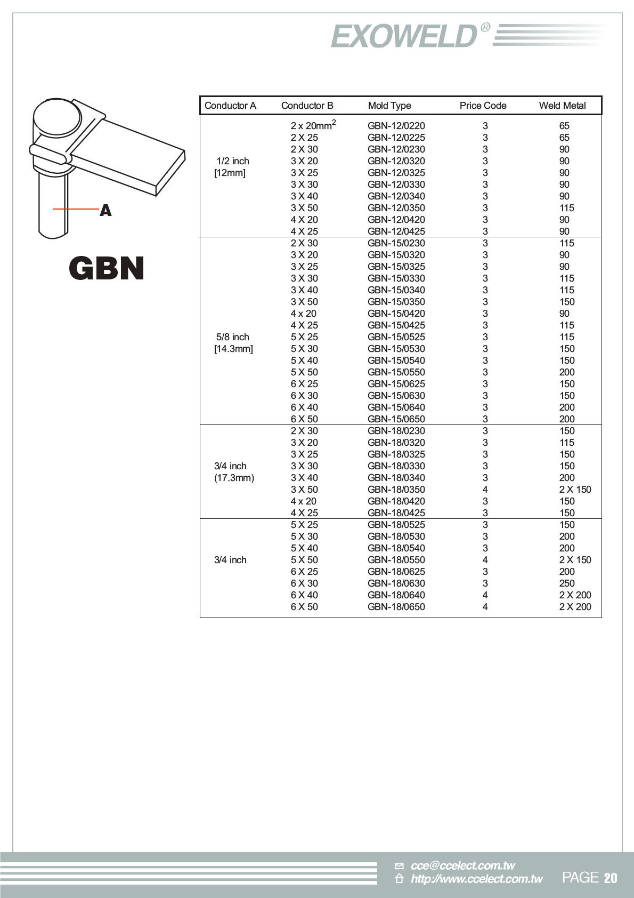](pages/page-20.png)
- 示意圖：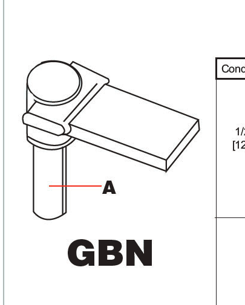

| 熔模型號 Mold Type | Price Code | Weld Metal | 配件 |
| --- | --- | --- | --- |
| `GBN-12/0220` | 3 | 65 | — |
| `GBN-12/0225` | 3 | 65 | — |
| `GBN-12/0230` | 3 | 90 | — |
| `GBN-12/0320` | 3 | 90 | — |
| `GBN-12/0325` | 3 | 90 | — |
| `GBN-12/0330` | 3 | 90 | — |
| `GBN-12/0340` | 3 | 90 | — |
| `GBN-12/0350` | 3 | 15 | — |
| `GBN-12/0420` | 3 | 90 | — |
| `GBN-12/0425` | 3 | 90 | — |
| `GBN-15/0230` | 3 | 15 | — |
| `GBN-15/0320` | 3 | 90 | — |
| `GBN-15/0325` | 3 | 90 | — |
| `GBN-15/0330` | 3 | 15 | — |
| `GBN-15/0340` | 3 | 115 | — |
| `GBN-15/0350` | 3 | 150 | — |
| `GBN-15/0420` | 3 | 90 | — |
| `GBN-15/0425` | 3 | 115 | — |
| `GBN-15/0525` | 3 | 115 | — |
| `GBN-15/0530` | 3 | 150 | — |
| `GBN-15/0540` | 3 | 150 | — |
| `GBN-15/0550` | 3 | 200 | — |
| `GBN-15/0625` | 3 | 150 | — |
| `GBN-15/0630` | 3 | 150 | — |
| `GBN-15/0640` | 3 | 200 | — |
| `GBN-15/0650` | 3 | 200 | — |
| `GBN-18/0230` | 3 | 150 | — |
| `GBN-18/0320` | 3 | 15 | — |
| `GBN-18/0325` | 3 | 150 | — |
| `GBN-18/0330` | 3 | 150 | — |
| `GBN-18/0340` | 3 | 200 | — |
| `GBN-18/0350` | 4 | 2X 150 | — |
| `GBN-18/0420` | 3 | 150 | — |
| `GBN-18/0425` | 3 | 150 | — |
| `GBN-18/0525` | 3 | 150 | — |
| `GBN-18/0530` | 3 | 200 | — |
| `GBN-18/0540` | 3 | 200 | — |
| `GBN-18/0550` | 4 | 2X 150 | — |
| `GBN-18/0625` | 3 | 200 | — |
| `GBN-18/0630` | 3 | 250 | — |
| `GBN-18/0640` | 4 | 2X 200 | — |
| `GBN-18/0650` | 4 | 2X 200 | — |


### GBT — 接地棒對扁銅排 T

Ground rod to busbar T

- 型錄頁：PAGE 21
- 整頁圖：[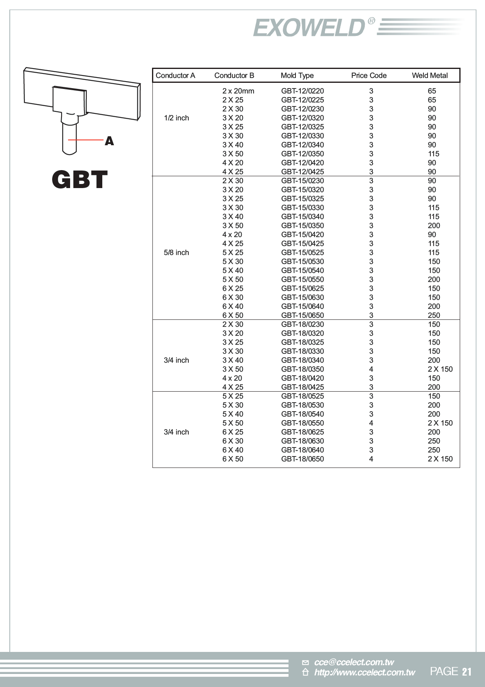](pages/page-21.png)
- 示意圖：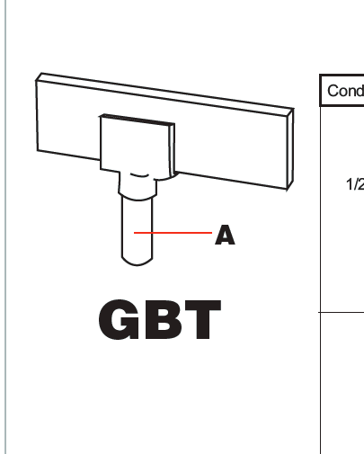

| 熔模型號 Mold Type | Price Code | Weld Metal | 配件 |
| --- | --- | --- | --- |
| `GBT-12/0220` | 3 | 65 | — |
| `GBT-12/0225` | 3 | 65 | — |
| `GBT-12/0230` | 3 | 90 | — |
| `GBT-12/0320` | 3 | 90 | — |
| `GBT-12/0325` | 3 | 90 | — |
| `GBT-12/0330` | 3 | 90 | — |
| `GBT-12/0340` | 3 | 90 | — |
| `GBT-12/0350` | 3 | 15 | — |
| `GBT-12/0420` | 3 | 90 | — |
| `GBT-12/0425` | 3 | 90 | — |
| `GBT-15/0230` | 3 | 90 | — |
| `GBT-15/0320` | 3 | 90 | — |
| `GBT-15/0325` | 3 | 90 | — |
| `GBT-15/0330` | 3 | 15 | — |
| `GBT-15/0340` | 3 | 15 | — |
| `GBT-15/0350` | 3 | 200 | — |
| `GBT-15/0420` | 3 | 90 | — |
| `GBT-15/0425` | 3 | 15 | — |
| `GBT-15/0525` | 3 | 15 | — |
| `GBT-15/0530` | 3 | 150 | — |
| `GBT-15/0540` | 3 | 150 | — |
| `GBT-15/0550` | 3 | 200 | — |
| `GBT-15/0625` | 3 | 150 | — |
| `GBT-15/0630` | 3 | 150 | — |
| `GBT-15/0640` | 3 | 200 | — |
| `GBT-15/0650` | 3 | 250 | — |
| `GBT-18/0230` | 3 | 150 | — |
| `GBT-18/0320` | 3 | 150 | — |
| `GBT-18/0325` | 3 | 150 | — |
| `GBT-18/0330` | 3 | 150 | — |
| `GBT-18/0340` | 3 | 200 | — |
| `GBT-18/0350` | 4 | 2X 150 | — |
| `GBT-18/0420` | 3 | 150 | — |
| `GBT-18/0425` | 3 | 200 | — |
| `GBT-18/0525` | 3 | 150 | — |
| `GBT-18/0530` | 3 | 200 | — |
| `GBT-18/0540` | 3 | 200 | — |
| `GBT-18/0550` | 4 | 2X 150 | — |
| `GBT-18/0625` | 3 | 200 | — |
| `GBT-18/0630` | 3 | 250 | — |
| `GBT-18/0640` | 3 | 250 | — |
| `GBT-18/0650` | 4 | 2X 150 | — |


<a id="series-s"></a>

## S 系列 — 鋼板／鋼管對線（Steel Sheets & Pipes）

鋼結構、鋼板、鋼管與銅導體。

### SHEA — 鋼板對線（水平 A）

Steel surface to cable H-A

- 型錄頁：PAGE 22
- 整頁圖：[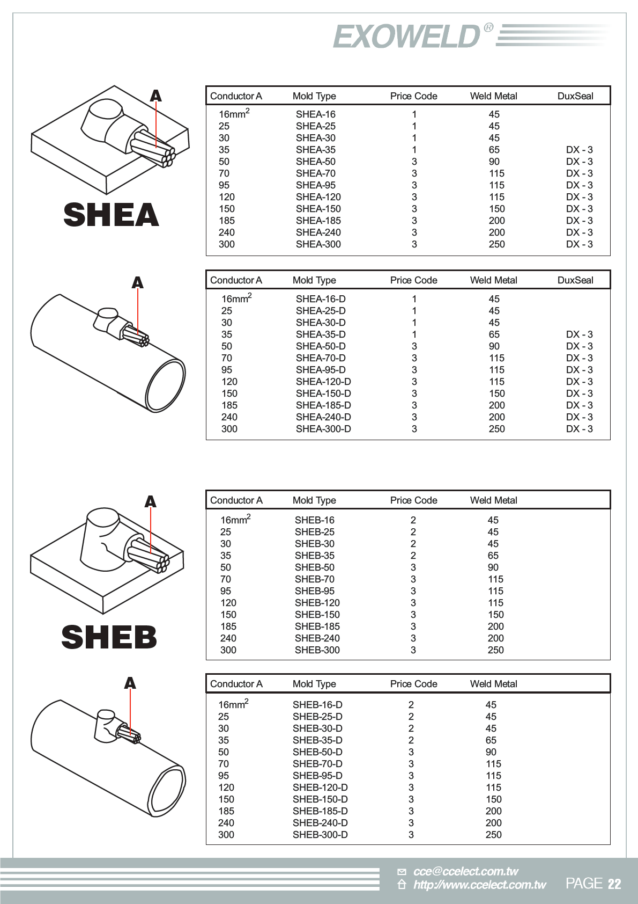](pages/page-22.png)
- 示意圖：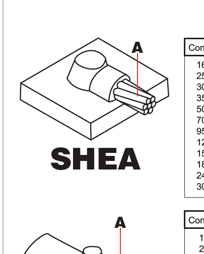

| 熔模型號 Mold Type | Price Code | Weld Metal | 配件 |
| --- | --- | --- | --- |
| `SHEA-16` | 1 | 45 | — |
| `SHEA-25` | 1 | 45 | — |
| `SHEA-30` | 1 | 45 | — |
| `SHEA-35` | 1 | 65 | DX-3 |
| `SHEA-50` | 3 | 90 | DX-3 |
| `SHEA-70` | 3 | 115 | DX-3 |
| `SHEA-95` | 3 | 115 | DX-3 |
| `SHEA-120` | 3 | 115 | DX-3 |
| `SHEA-150` | 3 | 150 | DX-3 |
| `SHEA-185` | 3 | 200 | DX-3 |
| `SHEA-240` | 3 | 200 | DX-3 |
| `SHEA-300` | 3 | 250 | DX-3 |
| `SHEA-16-D` | 1 | 45 | — |
| `SHEA-25-D` | 1 | 45 | — |
| `SHEA-30-D` | 1 | 45 | — |
| `SHEA-35-D` | 1 | 65 | DX-3 |
| `SHEA-50-D` | 3 | 90 | DX-3 |
| `SHEA-70-D` | 3 | 115 | DX-3 |
| `SHEA-95-D` | 3 | 115 | DX-3 |
| `SHEA-120-D` | 3 | 115 | DX-3 |
| `SHEA-150-D` | 3 | 150 | DX-3 |
| `SHEA-185-D` | 3 | 200 | DX-3 |
| `SHEA-240-D` | 3 | 200 | DX-3 |
| `SHEA-300-D` | 3 | 250 | DX-3 |


### SHEB — 鋼板對線（水平 B）

Steel surface to cable H-B

- 型錄頁：PAGE 22
- 整頁圖：[](pages/page-22.png)
- 示意圖：

| 熔模型號 Mold Type | Price Code | Weld Metal | 配件 |
| --- | --- | --- | --- |
| `SHEB-16` | 2 | 45 | — |
| `SHEB-25` | 2 | 45 | — |
| `SHEB-30` | 2 | 45 | — |
| `SHEB-35` | 2 | 65 | — |
| `SHEB-50` | 3 | 90 | — |
| `SHEB-70` | 3 | 115 | — |
| `SHEB-95` | 3 | 115 | — |
| `SHEB-120` | 3 | 115 | — |
| `SHEB-150` | 3 | 150 | — |
| `SHEB-185` | 3 | 200 | — |
| `SHEB-240` | 3 | 200 | — |
| `SHEB-300` | 3 | 250 | — |
| `SHEB-16-D` | 2 | 45 | — |
| `SHEB-25-D` | 2 | 45 | — |
| `SHEB-30-D` | 2 | 45 | — |
| `SHEB-35-D` | 2 | 65 | — |
| `SHEB-50-D` | 3 | 90 | — |
| `SHEB-70-D` | 3 | 115 | — |
| `SHEB-95-D` | 3 | 115 | — |
| `SHEB-120-D` | 3 | 115 | — |
| `SHEB-150-D` | 3 | 150 | — |
| `SHEB-185-D` | 3 | 200 | — |
| `SHEB-240-D` | 3 | 200 | — |
| `SHEB-300-D` | 3 | 250 | — |


### SHTA — 鋼板對線 T（A）

Steel to cable T-A

- 型錄頁：PAGE 23
- 整頁圖：[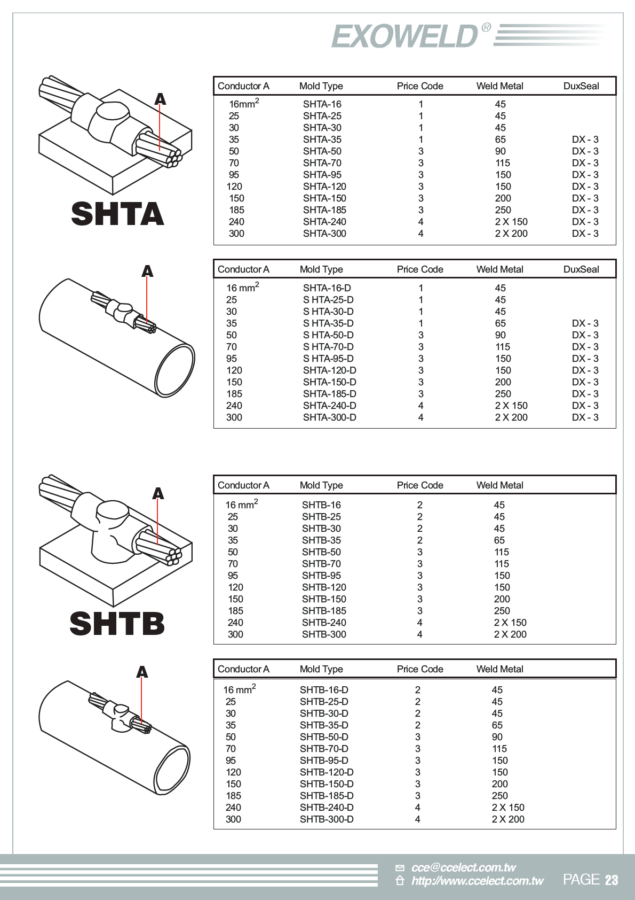](pages/page-23.png)
- 示意圖：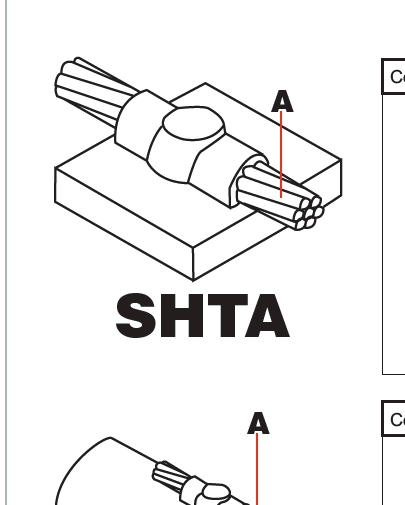

| 熔模型號 Mold Type | Price Code | Weld Metal | 配件 |
| --- | --- | --- | --- |
| `SHTA-16` | 1 | 45 | — |
| `SHTA-25` | 1 | 45 | — |
| `SHTA-30` | 1 | 45 | — |
| `SHTA-35` | 1 | 65 | DX-3 |
| `SHTA-50` | 3 | 90 | DX-3 |
| `SHTA-70` | 3 | 15 | DX-3 |
| `SHTA-95` | 3 | 150 | DX-3 |
| `SHTA-120` | 3 | 150 | DX-3 |
| `SHTA-150` | 3 | 200 | DX-3 |
| `SHTA-185` | 3 | 250 | DX-3 |
| `SHTA-240` | 4 | 2X 150 | DX-3 |
| `SHTA-300` | 4 | 2X 200 | DX-3 |
| `SHTA-16-D` | 1 | 45 | — |
| `SHTA-50-D` | 3 | 90 | DX-3 |
| `SHTA-70-D` | 3 | 15 | DX-3 |
| `SHTA-120-D` | 3 | 150 | DX-3 |
| `SHTA-150-D` | 3 | 200 | DX-3 |
| `SHTA-185-D` | 3 | 250 | DX-3 |
| `SHTA-240-D` | 4 | 2X 150 | DX-3 |
| `SHTA-300-D` | 4 | 2X 200 | DX-3 |


### SHTB — 鋼板對線 T（B）

Steel to cable T-B

- 型錄頁：PAGE 23
- 整頁圖：[](pages/page-23.png)
- 示意圖：

| 熔模型號 Mold Type | Price Code | Weld Metal | 配件 |
| --- | --- | --- | --- |
| `SHTB-16` | 2 | 45 | — |
| `SHTB-25` | 2 | 45 | — |
| `SHTB-30` | 2 | 45 | — |
| `SHTB-35` | 2 | 65 | — |
| `SHTB-50` | 3 | 15 | — |
| `SHTB-70` | 3 | 15 | — |
| `SHTB-95` | 3 | 150 | — |
| `SHTB-120` | 3 | 150 | — |
| `SHTB-150` | 3 | 200 | — |
| `SHTB-185` | 3 | 250 | — |
| `SHTB-240` | 4 | 2X 150 | — |
| `SHTB-300` | 4 | 2X 200 | — |
| `SHTB-16-D` | 2 | 45 | — |
| `SHTB-25-D` | 2 | 45 | — |
| `SHTB-30-D` | 2 | 45 | — |
| `SHTB-35-D` | 2 | 65 | — |
| `SHTB-50-D` | 3 | 90 | — |
| `SHTB-70-D` | 3 | 15 | — |
| `SHTB-95-D` | 3 | 150 | — |
| `SHTB-120-D` | 3 | 150 | — |
| `SHTB-150-D` | 3 | 200 | — |
| `SHTB-185-D` | 3 | 250 | — |
| `SHTB-240-D` | 4 | 2X 150 | — |
| `SHTB-300-D` | 4 | 2X 200 | — |


### SVES — 鋼管／立柱對線

Vertical steel/pipe to cable

- 型錄頁：PAGE 24
- 整頁圖：[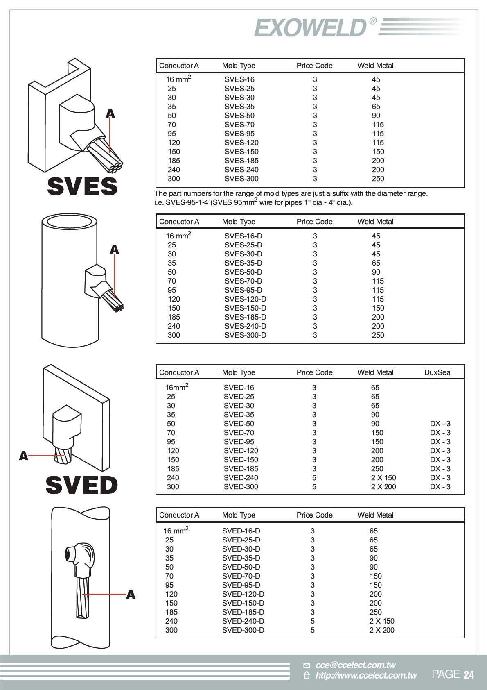](pages/page-24.png)
- 示意圖：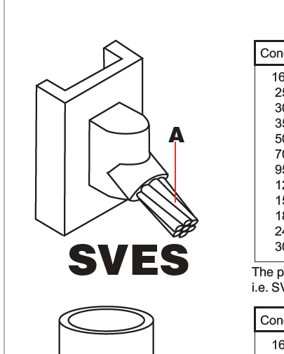

| 熔模型號 Mold Type | Price Code | Weld Metal | 配件 |
| --- | --- | --- | --- |
| `SVES-16` | 3 | 45 | — |
| `SVES-25` | 3 | 45 | — |
| `SVES-30` | 3 | 45 | — |
| `SVES-35` | 3 | 65 | — |
| `SVES-50` | 3 | 90 | — |
| `SVES-70` | 3 | 115 | — |
| `SVES-95` | 3 | 115 | — |
| `SVES-120` | 3 | 115 | — |
| `SVES-150` | 3 | 150 | — |
| `SVES-185` | 3 | 200 | — |
| `SVES-240` | 3 | 200 | — |
| `SVES-300` | 3 | 250 | — |
| `SVES-16-D` | 3 | 45 | — |
| `SVES-25-D` | 3 | 45 | — |
| `SVES-30-D` | 3 | 45 | — |
| `SVES-35-D` | 3 | 65 | — |
| `SVES-50-D` | 3 | 90 | — |
| `SVES-70-D` | 3 | 115 | — |
| `SVES-95-D` | 3 | 115 | — |
| `SVES-120-D` | 3 | 115 | — |
| `SVES-150-D` | 3 | 150 | — |
| `SVES-185-D` | 3 | 200 | — |
| `SVES-240-D` | 3 | 200 | — |
| `SVES-300-D` | 3 | 250 | — |


### SVED — 鋼管對線 D 型

Vertical steel to cable D

- 型錄頁：PAGE 24
- 整頁圖：[](pages/page-24.png)
- 示意圖：

| 熔模型號 Mold Type | Price Code | Weld Metal | 配件 |
| --- | --- | --- | --- |
| `SVED-16` | 3 | 65 | — |
| `SVED-25` | 3 | 65 | — |
| `SVED-30` | 3 | 65 | — |
| `SVED-35` | 3 | 90 | — |
| `SVED-50` | 3 | 90 | DX-3 |
| `SVED-70` | 3 | 150 | DX-3 |
| `SVED-95` | 3 | 150 | DX-3 |
| `SVED-120` | 3 | 200 | DX-3 |
| `SVED-150` | 3 | 200 | DX-3 |
| `SVED-185` | 3 | 250 | DX-3 |
| `SVED-240` | 5 | 2X 150 | DX-3 |
| `SVED-300` | 5 | 2X 200 | DX-3 |
| `SVED-16-D` | 3 | 65 | — |
| `SVED-25-D` | 3 | 65 | — |
| `SVED-30-D` | 3 | 65 | — |
| `SVED-35-D` | 3 | 90 | — |
| `SVED-50-D` | 3 | 90 | — |
| `SVED-70-D` | 3 | 150 | — |
| `SVED-95-D` | 3 | 150 | — |
| `SVED-120-D` | 3 | 200 | — |
| `SVED-150-D` | 3 | 200 | — |
| `SVED-185-D` | 3 | 250 | — |
| `SVED-240-D` | 5 | 2X 150 | — |
| `SVED-300-D` | 5 | 2X 200 | — |


### SVEU — 鋼管對線 U 型

Vertical steel to cable U

- 型錄頁：PAGE 25
- 整頁圖：[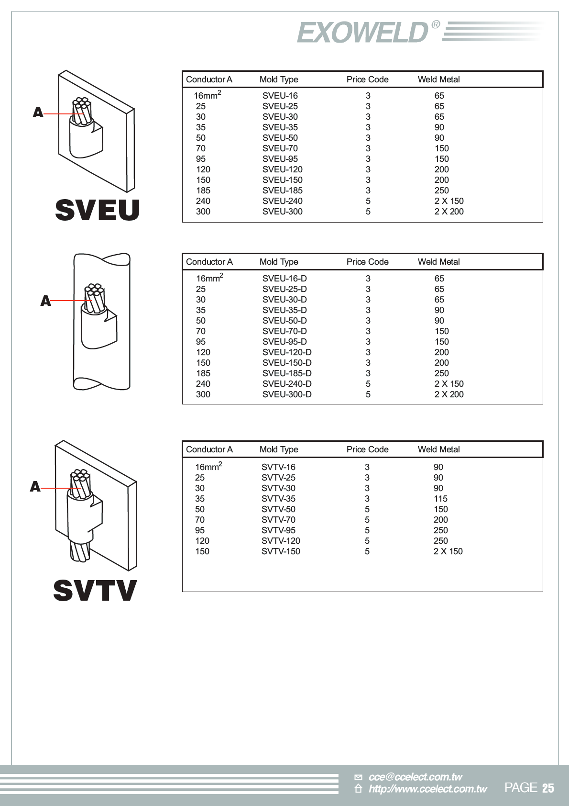](pages/page-25.png)
- 示意圖：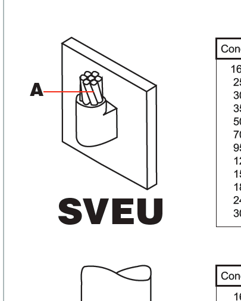

| 熔模型號 Mold Type | Price Code | Weld Metal | 配件 |
| --- | --- | --- | --- |
| `SVEU-16` | 3 | 65 | — |
| `SVEU-25` | 3 | 65 | — |
| `SVEU-30` | 3 | 65 | — |
| `SVEU-35` | 3 | 90 | — |
| `SVEU-50` | 3 | 90 | — |
| `SVEU-70` | 3 | 150 | — |
| `SVEU-95` | 3 | 150 | — |
| `SVEU-120` | 3 | 200 | — |
| `SVEU-150` | 3 | 200 | — |
| `SVEU-185` | 3 | 250 | — |
| `SVEU-240` | 5 | 2X 150 | — |
| `SVEU-300` | 5 | 2X 200 | — |
| `SVEU-16-D` | 3 | 65 | — |
| `SVEU-25-D` | 3 | 65 | — |
| `SVEU-30-D` | 3 | 65 | — |
| `SVEU-35-D` | 3 | 90 | — |
| `SVEU-50-D` | 3 | 90 | — |
| `SVEU-70-D` | 3 | 150 | — |
| `SVEU-95-D` | 3 | 150 | — |
| `SVEU-120-D` | 3 | 200 | — |
| `SVEU-150-D` | 3 | 200 | — |
| `SVEU-185-D` | 3 | 250 | — |
| `SVEU-240-D` | 5 | 2X 150 | — |
| `SVEU-300-D` | 5 | 2X 200 | — |


### SVTV — 鋼管對線垂直 T

Vertical steel to cable T

- 型錄頁：PAGE 25
- 整頁圖：[](pages/page-25.png)
- 示意圖：

| 熔模型號 Mold Type | Price Code | Weld Metal | 配件 |
| --- | --- | --- | --- |
| `SVTV-16` | 3 | 90 | — |
| `SVTV-25` | 3 | 90 | — |
| `SVTV-30` | 3 | 90 | — |
| `SVTV-35` | 3 | 115 | — |
| `SVTV-50` | 5 | 150 | — |
| `SVTV-70` | 5 | 200 | — |
| `SVTV-95` | 5 | 250 | — |
| `SVTV-120` | 5 | 250 | — |
| `SVTV-150` | 5 | 2X 150 | — |


### SVTHA — 鋼管對線水平 T（A）

Steel horizontal T-A

- 型錄頁：PAGE 26
- 整頁圖：[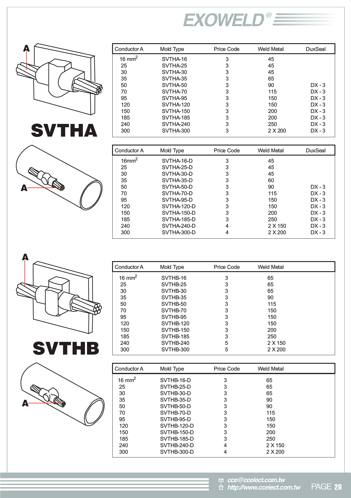](pages/page-26.png)
- 示意圖：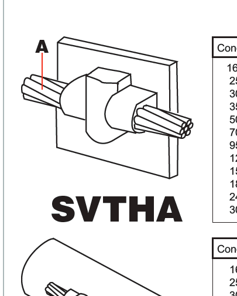

| 熔模型號 Mold Type | Price Code | Weld Metal | 配件 |
| --- | --- | --- | --- |
| `SVTHA-16` | 3 | 45 | — |
| `SVTHA-25` | 3 | 45 | — |
| `SVTHA-30` | 3 | 45 | — |
| `SVTHA-35` | 3 | 65 | — |
| `SVTHA-50` | 3 | 90 | DX-3 |
| `SVTHA-70` | 3 | 115 | DX-3 |
| `SVTHA-95` | 3 | 150 | DX-3 |
| `SVTHA-120` | 3 | 150 | DX-3 |
| `SVTHA-150` | 3 | 200 | DX-3 |
| `SVTHA-185` | 3 | 200 | DX-3 |
| `SVTHA-240` | 3 | 250 | DX-3 |
| `SVTHA-300` | 3 | 2X 200 | DX-3 |
| `SVTHA-16-D` | 3 | 45 | — |
| `SVTHA-25-D` | 3 | 45 | — |
| `SVTHA-30-D` | 3 | 45 | — |
| `SVTHA-35-D` | 3 | 60 | — |
| `SVTHA-50-D` | 3 | 90 | DX-3 |
| `SVTHA-70-D` | 3 | 115 | DX-3 |
| `SVTHA-95-D` | 3 | 150 | DX-3 |
| `SVTHA-120-D` | 3 | 150 | DX-3 |
| `SVTHA-150-D` | 3 | 200 | DX-3 |
| `SVTHA-185-D` | 3 | 250 | DX-3 |
| `SVTHA-240-D` | 4 | 2X150 | DX-3 |
| `SVTHA-300-D` | 4 | 2X 200 | DX-3 |


### SVTHB — 鋼管對線水平 T（B）

Steel horizontal T-B

- 型錄頁：PAGE 26
- 整頁圖：[](pages/page-26.png)
- 示意圖：

| 熔模型號 Mold Type | Price Code | Weld Metal | 配件 |
| --- | --- | --- | --- |
| `SVTHB-16` | 3 | 65 | — |
| `SVTHB-25` | 3 | 65 | — |
| `SVTHB-30` | 3 | 65 | — |
| `SVTHB-35` | 3 | 90 | — |
| `SVTHB-50` | 3 | 115 | — |
| `SVTHB-70` | 3 | 150 | — |
| `SVTHB-95` | 3 | 150 | — |
| `SVTHB-120` | 3 | 150 | — |
| `SVTHB-150` | 3 | 200 | — |
| `SVTHB-185` | 3 | 250 | — |
| `SVTHB-240` | 5 | 2X150 | — |
| `SVTHB-300` | 5 | 2X 200 | — |
| `SVTHB-16-D` | 3 | 65 | — |
| `SVTHB-25-D` | 3 | 65 | — |
| `SVTHB-30-D` | 3 | 65 | — |
| `SVTHB-35-D` | 3 | 90 | — |
| `SVTHB-50-D` | 3 | 90 | — |
| `SVTHB-70-D` | 3 | 115 | — |
| `SVTHB-95-D` | 3 | 150 | — |
| `SVTHB-120-D` | 3 | 150 | — |
| `SVTHB-150-D` | 3 | 200 | — |
| `SVTHB-185-D` | 3 | 250 | — |
| `SVTHB-240-D` | 4 | 2X150 | — |
| `SVTHB-300-D` | 4 | 2X 200 | — |


### SVEH — 鋼管對線側向（L/R）

Vertical steel side L/R

- 型錄頁：PAGE 27
- 整頁圖：[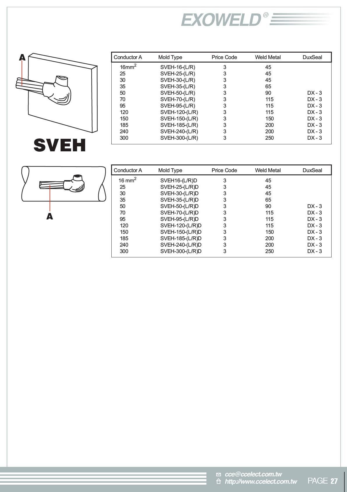](pages/page-27.png)
- 示意圖：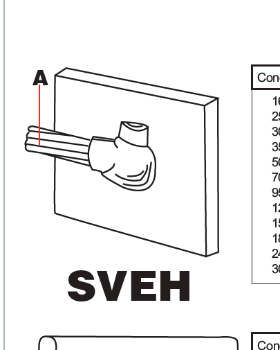

| 熔模型號 Mold Type | Price Code | Weld Metal | 配件 |
| --- | --- | --- | --- |
| `SVEH-16-(L/R)` | 3 | 45 | — |
| `SVEH-25-L/R)` | 3 | 45 | — |
| `SVEH-30-L/R)` | 3 | 45 | — |
| `SVEH-35-(L/R)` | 3 | 65 | — |
| `SVEH-50-L/R)` | 3 | 90 | DX-3 |
| `SVEH-70-(LIR)` | 3 | 15 | DX-3 |
| `SVEH-95-L/R)` | 3 | 15 | DX-3 |
| `SVEH-120-(L/R)` | 3 | 15 | DX-3 |
| `SVEH-150-(L/R)` | 3 | 150 | DX-3 |
| `SVEH-185-(L/R)` | 3 | 200 | DX-3 |
| `SVEH-240-(LIR)` | 3 | 200 | DX-3 |
| `SVEH-300-(L/R)` | 3 | 250 | DX-3 |
| `SVEH-25-(LIR)D` | 3 | 45 | — |
| `SVEH-30-(L/IR)D` | 3 | 45 | — |
| `SVEH-35-LIR)D` | 3 | 65 | — |
| `SVEH-50-(L/R)D` | 3 | 90 | DX-3 |
| `SVEH-70-L/R)D` | 3 | 15 | DX-3 |
| `SVEH-120-(L/R)D` | 3 | 15 | DX-3 |
| `SVEH-150-(L/R)D` | 3 | 150 | DX-3 |
| `SVEH-185-(L/R)D` | 3 | 200 | DX-3 |
| `SVEH-240-(L/R)D` | 3 | 200 | DX-3 |
| `SVEH-300-(L/R)D` | 3 | 250 | DX-3 |


<a id="series-r"></a>

## R 系列 — 鋼筋對線（Wire to Rebar）

鋼筋（常見 Ø10 / Ø25 mm）與銅導體。

### RHEH — 鋼筋對線水平

Rebar to wire horizontal

- 型錄頁：PAGE 28（相關頁：28, 29, 30）
- 整頁圖：[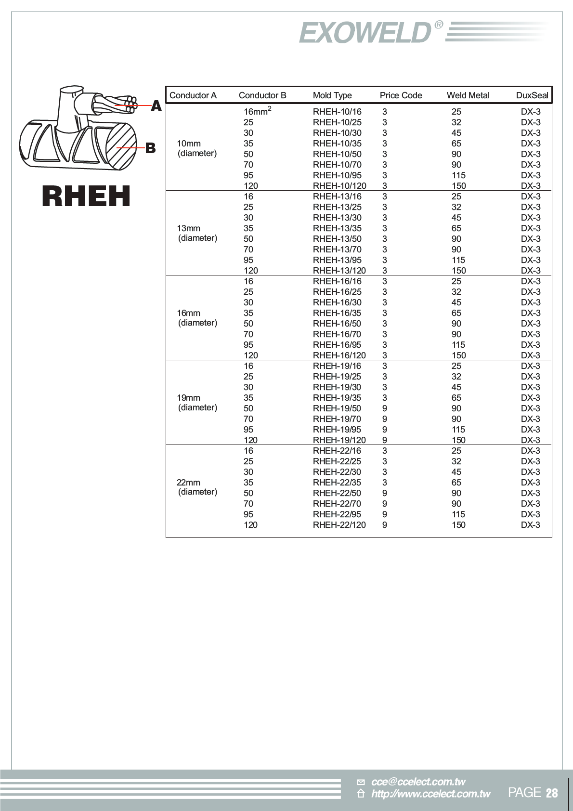](pages/page-28.png)
- 示意圖：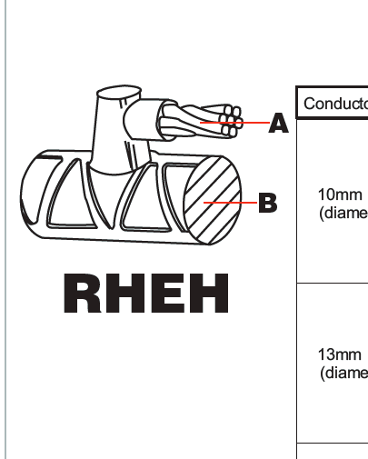

| 熔模型號 Mold Type | Price Code | Weld Metal | 配件 |
| --- | --- | --- | --- |
| `RHEH-10/16` | 3 | 25 | DX-3 |
| `RHEH-10/25` | 3 | 32 | DX-3 |
| `RHEH-10/30` | 3 | 45 | DX-3 |
| `RHEH-10/35` | 3 | 65 | DX-3 |
| `RHEH-10/50` | 3 | 90 | DX-3 |
| `RHEH-10/70` | 3 | 90 | DX-3 |
| `RHEH-10/95` | 3 | 115 | DX-3 |
| `RHEH-10/120` | 3 | 150 | DX-3 |
| `RHEH-13/25` | 3 | 32 | DX-3 |
| `RHEH-13/30` | 3 | 45 | DX-3 |
| `RHEH-13/35` | 3 | 65 | DX-3 |
| `RHEH-13/50` | 3 | 90 | DX-3 |
| `RHEH-13/70` | 3 | 90 | DX-3 |
| `RHEH-13/95` | 3 | 115 | DX-3 |
| `RHEH-16/25` | 3 | 32 | DX-3 |
| `RHEH-16/30` | 3 | 45 | DX-3 |
| `RHEH-16/35` | 3 | 65 | DX-3 |
| `RHEH-16/50` | 3 | 90 | DX-3 |
| `RHEH-16/70` | 3 | 90 | DX-3 |
| `RHEH-16/95` | 3 | 15 | DX-3 |
| `RHEH-19/16` | 3 | 25 | — |
| `RHEH-19/25` | 3 | 32 | DX-3 |
| `RHEH-19/30` | 3 | 45 | DX-3 |
| `RHEH-19/35` | 3 | 65 | DX-3 |
| `RHEH-19/50` | 9 | 90 | DX-3 |
| `RHEH-19/70` | 9 | 90 | DX-3 |
| `RHEH-19/95` | 9 | 15 | DX-3 |
| `RHEH-22/16` | 3 | 25 | DX-3 |
| `RHEH-22/25` | 3 | 32 | DX-3 |
| `RHEH-22/35` | 3 | 65 | DX-3 |
| `RHEH-22/50` | 9 | 90 | DX-3 |
| `RHEH-22/70` | 9 | 90 | DX-3 |
| `RHEH-2295` | 9 | 15 | DX-3 |
| `RHEH-22/120` | 9 | 150 | DX-3 |
| `RHEH-1035` | 3 | 65 | DX-3 |
| `RHEH-1070` | 3 | 90 | DX-3 |
| `RHEH-1095` | 3 | 15 | DX-3 |
| `RHEH-13/16` | 3 | 25 | DX-3 |
| `RHEH-1395` | 3 | 15 | DX-3 |
| `RHEH-16/16` | 3 | 25 | DX-3 |
| `RHEH-1916` | 3 | 25 | DX-3 |
| `RHEH-19/120` | 9 | 150 | DX-3 |
| `RHEH-22/30` | 3 | 45 | DX-3 |
| `RHEH-22/95` | 9 | 115 | DX-3 |
| `RHEH-25/30` | 3 | 45 | — |
| `RHEH-25/35` | 3 | 65 | DX-3 |
| `RHEH-25/50` | 3 | 90 | DX-3 |
| `RHEH-25/70` | 3 | 115 | DX-3 |
| `RHEH-25/95` | 3 | 115 | DX-3 |
| `RHEH-25/120` | 3 | 150 | DX-3 |
| `RHEH-29/30` | 1 | 45 | DX-3 |
| `RHEH-29/35` | 1 | 65 | DX-3 |
| `RHEH-29/70` | 3 | 115 | DX-3 |
| `RHEH-29/95` | 3 | 115 | DX-3 |
| `RHEH-32/30` | 1 | 45 | DX-3 |
| `RHEH-32/35` | 1 | 65 | DX-3 |
| `RHEH-32/50` | 3 | 90 | DX-3 |
| `RHEH-32/70` | 3 | 115 | DX-3 |
| `RHEH-32/95` | 3 | 115 | DX-3 |
| `RHEH-32/120` | 3 | 150 | DX-3 |
| `RHEH-36/30` | 1 | 45 | DX-3 |
| `RHEH-36/35` | 1 | 65 | DX-3 |
| `RHEH-36/50` | 9 | 90 | DX-3 |
| `RHEH-36/70` | 9 | 115 | DX-3 |
| `RHEH-36/95` | 9 | 115 | DX-3 |
| `RHEH-43/30` | 9 | 45 | DX-3 |
| `RHEH-43/35` | 9 | 65 | DX-3 |
| `RHEH-43/50` | 9 | 90 | DX-3 |
| `RHEH-43/70` | 9 | 115 | DX-3 |
| `RHEH-43/95` | 9 | 115 | DX-3 |
| `RHEH-43/120` | 9 | 150 | DX-3 |
| `RHEH-57/50` | 9 | 90 | DX-3 |
| `RHEH-57/70` | 9 | 115 | DX-3 |
| `RHEH-57/95` | 9 | 115 | DX-3 |
| `RHEH-57/120` | 9 | 150 | DX-3 |


### RHXH — 鋼筋對線交叉

Rebar to wire cross

- 型錄頁：PAGE 31（相關頁：31, 32）
- 整頁圖：[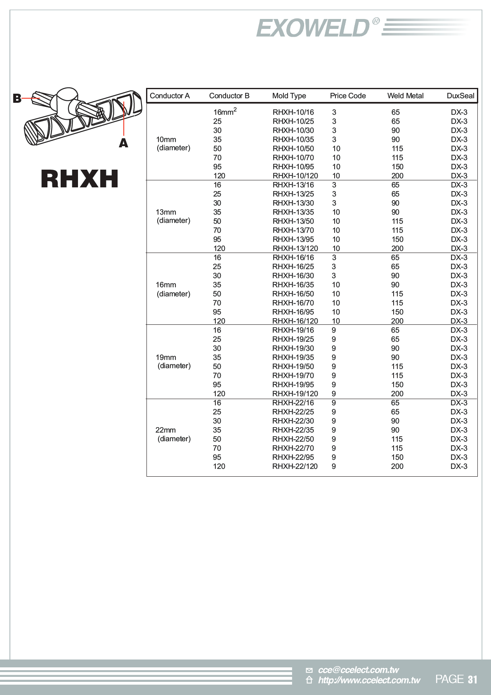](pages/page-31.png)
- 示意圖：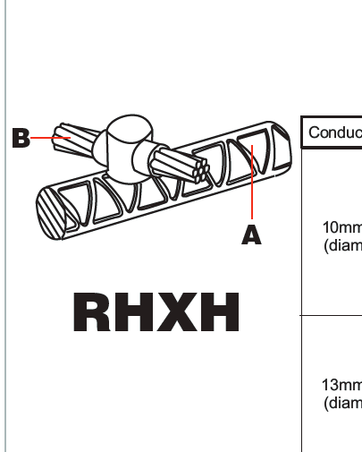

| 熔模型號 Mold Type | Price Code | Weld Metal | 配件 |
| --- | --- | --- | --- |
| `RHXH-10/25` | 3 | 65 | DX-3 |
| `RHXH-10/30` | 3 | 90 | DX-3 |
| `RHXH-10/85` | 3 | 90 | DX-3 |
| `RHXH-10/50` | 10 | 115 | DX-3 |
| `RHXH-10/70` | 10 | 115 | DX-3 |
| `RHXH-1095` | 10 | 150 | DX-3 |
| `RHXH-10/120` | 10 | 200 | DX-3 |
| `RHXH-13/25` | 3 | 65 | DX-3 |
| `RHXH-13/30` | 3 | 20 | DX-3 |
| `RHXH-13/35` | 10 | 20 | DX-3 |
| `RHXH-13/50` | 10 | 115 | DX-3 |
| `RHXH-13/70` | 10 | 115 | DX-3 |
| `RHXH-13/95` | 10 | 150 | DX-3 |
| `RHXH-16/16` | 3 | 65 | DX-3 |
| `RHXH-16/25` | 3 | 65 | DX-3 |
| `RHXH-16/30` | 3 | 90 | DX-3 |
| `RHXH-16/35` | 10 | 90 | DX-3 |
| `RHXH-16/50` | 10 | 115 | DX-3 |
| `RHXH-16/70` | 10 | 115 | DX-3 |
| `RHXH-16/95` | 10 | 150 | DX-3 |
| `RHXH-16/120` | 10 | 200 | DX-3 |
| `RHXH-19/16` | 9 | 65 | DX-3 |
| `RHXH-19/25` | 9 | 65 | DX-3 |
| `RHXH-19/30` | 9 | 90 | DX-3 |
| `RHXH-19/35` | 9 | 90 | DX-3 |
| `RHXH-19/50` | 9 | 115 | DX-3 |
| `RHXH-19/70` | 9 | 115 | DX-3 |
| `RHXH-19/95` | 9 | 150 | DX-3 |
| `RHXH-22/16` | 9 | 65 | DX-3 |
| `RHXH-22/25` | 9 | 65 | DX-3 |
| `RHXH-22/30` | 9 | 90 | DX-3 |
| `RHXH-22/35` | 9 | 90 | DX-3 |
| `RHXH-22/50` | 9 | 115 | DX-3 |
| `RHXH-22/70` | 9 | 115 | DX-3 |
| `RHXH-22/95` | 9 | 150 | DX-3 |
| `RHXH-22/120` | 9 | 200 | DX-3 |
| `RHXH-25/30` | 9 | 90 | DX-3 |
| `RHXH-25/35` | 9 | 90 | DX-3 |
| `RHXH-25/50` | 9 | 115 | DX-3 |
| `RHXH-25/70` | 9 | 15 | DX-3 |
| `RHXH-25/95` | 9 | 150 | DX-3 |
| `RHXH-29/30` | 9 | 90 | DX-3 |
| `RHXH-29/35` | 9 | 90 | DX-3 |
| `RHXH-29/50` | 9 | 15 | DX-3 |
| `RHXH-29/70` | 9 | 15 | DX-3 |
| `RHXH-29/95` | 9 | 150 | DX-3 |
| `RHXH-29/120` | 9 | 2010 | DX-3 |
| `RHXH-32/30` | 9 | 90 | DX-3 |
| `RHXH-32/85` | 9 | 90 | DX-3 |
| `RHXH-32/50` | 9 | 15 | DX-3 |
| `RHXH-32/70` | 9 | 115 | DX-3 |
| `RHXH-32/95` | 9 | 150 | DX-3 |
| `RHXH-3630` | 9 | 90 | DX-3 |
| `RHXH-36/35` | 9 | 90 | DX-3 |
| `RHXH-36/50` | 9 | 15 | DX-3 |
| `RHXH-36/70` | 9 | 115 | DX-3 |
| `RHXH-36/95` | 9 | 150 | DX-3 |
| `RHXH-36/120` | 9 | 200 | DX-3 |
| `RHXH-43/30` | 9 | 90 | DX-3 |
| `RHXH-43/35` | 9 | 90 | DX-3 |
| `RHXH-43/50` | 9 | 15 | DX-3 |
| `RHXH-43/70` | 9 | 15 | DX-3 |
| `RHXH-43/95` | 9 | 150 | DX-3 |
| `RHXH-57/50` | 9 | 15 | DX-3 |
| `RHXH-57/70` | 9 | 115 | DX-3 |
| `RHXH-57/95` | 9 | 150 | DX-3 |
| `RHXH-57/120` | 9 | 200 | DX-3 |


### RVXH — 鋼筋對線垂直交叉

Rebar to wire vertical cross

- 型錄頁：PAGE 33（相關頁：33, 34）
- 整頁圖：[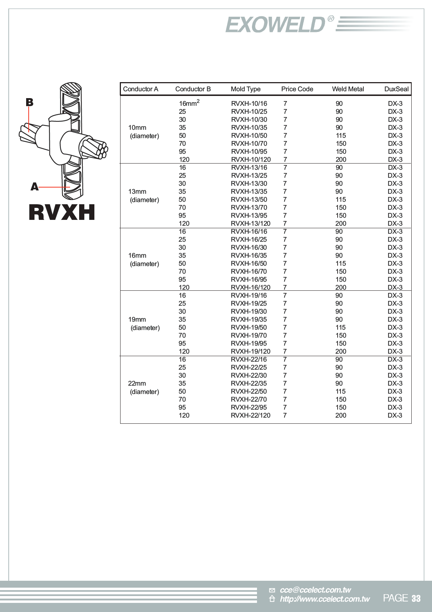](pages/page-33.png)
- 示意圖：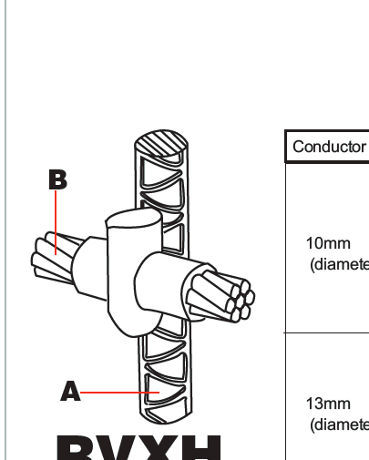

| 熔模型號 Mold Type | Price Code | Weld Metal | 配件 |
| --- | --- | --- | --- |
| `RVXH-10/16` | 7 | 20 | DX-3 |
| `RVXH-10/25` | 7 | 90 | DX-3 |
| `RVXH-10/30` | 7 | 90 | DX-3 |
| `RVXH-10/35` | 7 | 90 | DX-3 |
| `RVXH-10/50` | 7 | 115 | DX-3 |
| `RVXH-10/70` | 7 | 150 | DX-3 |
| `RVXH-10/95` | 7 | 150 | DX-3 |
| `RVXH-13/25.` | 7 | 90 | DX-3 |
| `RVXH-13/30` | 7 | 90 | DX-3 |
| `RVXH-13/35` | 7 | 90 | DX-3 |
| `RVXH-13/50` | 7 | 115 | DX-3 |
| `RVXH-13/70` | 7 | 150 | DX-3 |
| `RVXH-13/95` | 7 | 150 | DX-3 |
| `RVXH-46/16` | 7 | 90 | DX-3 |
| `RVXH-16/25` | 7 | 90 | DX-3 |
| `RVXH-16/30` | 7 | 90 | DX-3 |
| `RVXH-16/35` | 7 | 90 | DX-3 |
| `RVXH-16/50` | 7 | 115 | DX-3 |
| `RVXH-16/70` | 7 | 150 | DX-3 |
| `RVXH-16/95` | 7 | 150 | DX-3 |
| `RVXH-19/16` | 7 | 90 | DX-3 |
| `RVXH-19/25` | 7 | 90 | DX-3 |
| `RVXH-1980` | 7 | 90 | DX-3 |
| `RVXH-19385` | 7 | 90 | DX-3 |
| `RVXH-19/50` | 7 | 115 | DX-3 |
| `RVXH-19/70` | 7 | 150 | DX-3 |
| `RVXH-1995` | 7 | 150 | DX-3 |
| `RVXH-22/16` | 7 | 90 | DX-3 |
| `RVXH-22/25` | 7 | 90 | DX-3 |
| `RVXH-2280` | 7 | 90 | DX-3 |
| `RVXH-2285.` | 7 | 90 | DX-3 |
| `RVXH-22/50` | 7 | 115 | DX-3 |
| `RVXH-22/70` | 7 | 150 | DX-3 |
| `RVXH-22/95` | 7 | 150 | DX-3 |
| `RVXH-22/120` | 7 | 200 | DX-3 |
| `RVXH-25/30` | 7 | 90 | DX-3 |
| `RVXH-25/35` | 7 | 90 | DX-3 |
| `RVXH-25/50` | 7 | 15 | DX-3 |
| `RVXH-25/70` | 7 | 150 | DX-3 |
| `RVXH-25/95` | 7 | 150 | DX-3 |
| `RVXH-29/30` | 7 | 90 | DX-3 |
| `RVXH-29/35` | 7 | 90 | DX-3 |
| `RVXH-29/50` | 7 | 15 | DX-3 |
| `RVXH-29/70` | 7 | 150 | DX-3 |
| `RVXH-29/95` | 7 | 150 | DX-3 |
| `RVXH-32/30` | 7 | 90 | DX-3 |
| `RVXH-32/35` | 7 | 90 | DX-3 |
| `RVXH-32/50` | 7 | 15 | DX-3 |
| `RVXH-32/70` | 7 | 150 | DX-3 |
| `RVXH-32/95` | 7 | 150 | DX-3 |
| `RVXH-36/30` | 7 | 90 | DX-3 |
| `RVXH-36/35` | 7 | 90 | DX-3 |
| `RVXH-36/50` | 7 | 15 | DX-3 |
| `RVXH-36/70` | 7 | 150 | DX-3 |
| `RVXH-36/95` | 7 | 150 | DX-3 |
| `RVXH-43/30` | 7 | 90 | DX-3 |
| `RVXH-43/35.` | 7 | 90 | DX-3 |
| `RVXH-43/50` | 7 | 115 | DX-3 |
| `RVXH-43/70` | 7 | 150 | DX-3 |
| `RVXH-43/95` | 7 | 150 | DX-3 |
| `RVXH-57/50` | 7 | 115 | DX-3 |
| `RVXH-57/70` | 7 | 150 | DX-3 |
| `RVXH-57/95` | 7 | 150 | DX-3 |
| `RVXH-57/120` | 7 | 200 | DX-3 |


<a id="series-p"></a>

## P 系列 — 線對扁銅排（Cable to Busbar）

銅導體與扁銅排。

### PK — 線對扁銅排

Cable to busbar

- 型錄頁：PAGE 35
- 整頁圖：[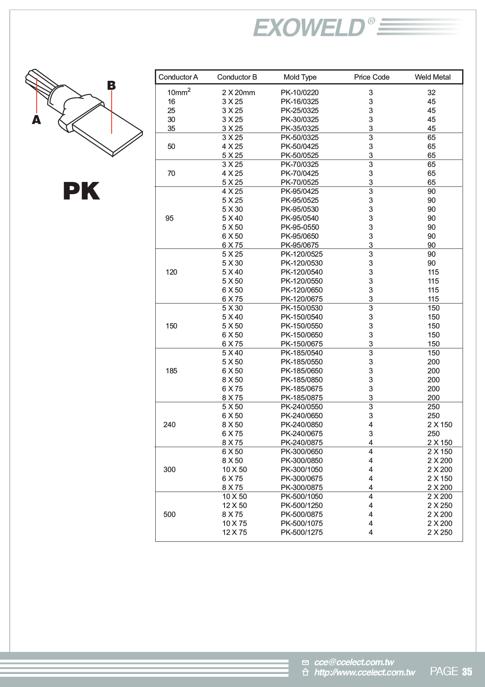](pages/page-35.png)
- 示意圖：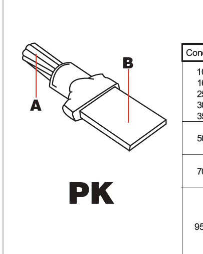

| 熔模型號 Mold Type | Price Code | Weld Metal | 配件 |
| --- | --- | --- | --- |
| `PK-10/0220` | 3 | 32 | — |
| `PK-16/0325` | 3 | 45 | — |
| `PK-25/0325` | 3 | 45 | — |
| `PK-30/0325` | 3 | 45 | — |
| `PK-35/0325` | 3 | 45 | — |
| `PK-50/0325` | 3 | 65 | — |
| `PK-50/0425` | 3 | 65 | — |
| `PK-50/0525` | 3 | 65 | — |
| `PK-70/0325` | 3 | 65 | — |
| `PK-70/0425` | 3 | 65 | — |
| `PK-70/0525` | 3 | 65 | — |
| `PK-95/0425` | 3 | 90 | — |
| `PK-95/0525` | 3 | 90 | — |
| `PK-95/0530` | 3 | 90 | — |
| `PK-95/0540` | 3 | 90 | — |
| `PK-95-0550` | 3 | 90 | — |
| `PK-95/0650` | 3 | 90 | — |
| `PK-95/0675` | 3 | 90 | — |
| `PK-120/0525` | 3 | 90 | — |
| `PK-120/0530` | 3 | 90 | — |
| `PK-120/0540` | 3 | 15 | — |
| `PK-120/0550` | 3 | 15 | — |
| `PK-120/0650` | 3 | 15 | — |
| `PK-120/0675` | 3 | 15 | — |
| `PK-150/0530` | 3 | 150 | — |
| `PK-150/0540` | 3 | 150 | — |
| `PK-150/0550` | 3 | 150 | — |
| `PK-150/0650` | 3 | 150 | — |
| `PK-150/0675` | 3 | 150 | — |
| `PK-185/0540` | 3 | 150 | — |
| `PK-185/0550` | 3 | 200 | — |
| `PK-185/0650` | 3 | 200 | — |
| `PK-185/0850` | 3 | 200 | — |
| `PK-185/0675` | 3 | 200 | — |
| `PK-185/0875` | 3 | 200 | — |
| `PK-240/0550` | 3 | 250 | — |
| `PK-240/0650` | 3 | 250 | — |
| `PK-240/0850` | 4 | 2X 150 | — |
| `PK-240/0675` | 3 | 250 | — |
| `PK-240/0875` | 4 | 2X 150 | — |
| `PK-300/0650` | 4 | 2X 150 | — |
| `PK-300/0850` | 4 | 2X200 | — |
| `PK-300/1050` | 4 | 2X200 | — |
| `PK-300/0675` | 4 | 2X 150 | — |
| `PK-300/0875` | 4 | 2X200 | — |
| `PK-500/1050` | 4 | 2X 200 | — |
| `PK-500/1250` | 4 | 2X 250 | — |
| `PK-500/0875` | 4 | 2X200 | — |
| `PK-500/1075` | 4 | 2X200 | — |
| `PK-500/1275` | 4 | 2X 250 | — |


### PV — 線對扁銅排垂直

Cable to busbar vertical

- 型錄頁：PAGE 36
- 整頁圖：[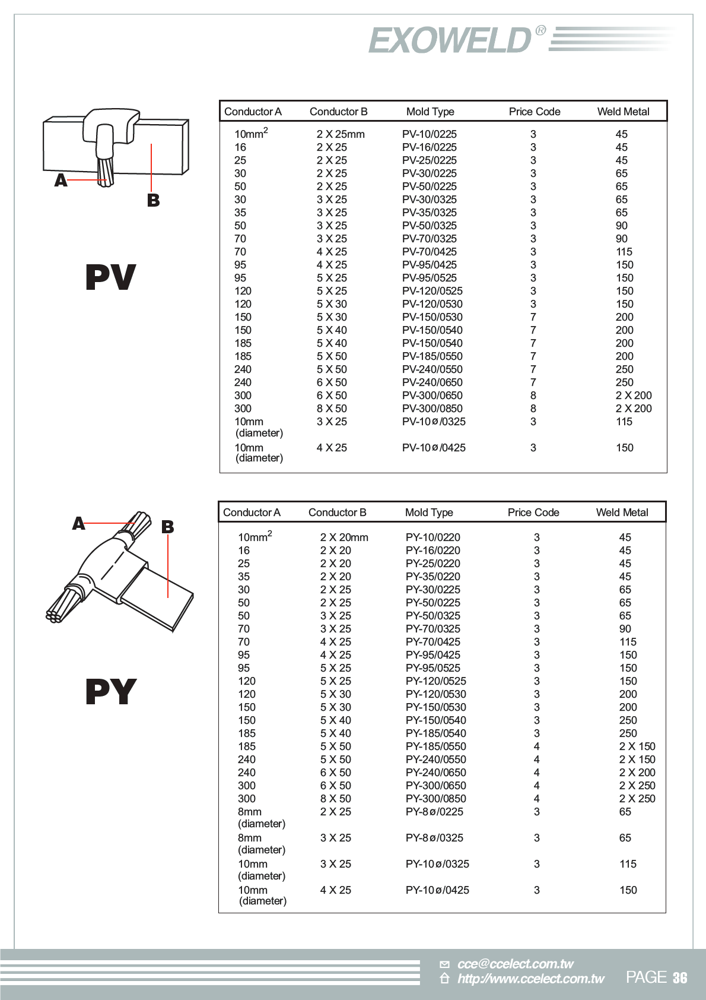](pages/page-36.png)
- 示意圖：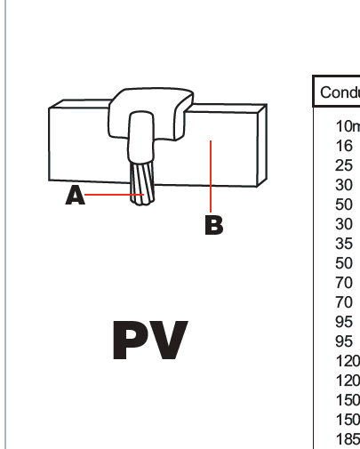

| 熔模型號 Mold Type | Price Code | Weld Metal | 配件 |
| --- | --- | --- | --- |
| `PV-10/0225` | 3 | 45 | — |
| `PV-16/0225` | 3 | 45 | — |
| `PV-25/0225` | 3 | 45 | — |
| `PV-30/0225` | 3 | 65 | — |
| `PV-50/0225` | 3 | 65 | — |
| `PV-30/0325` | 3 | 65 | — |
| `PV-35/0325` | 3 | 65 | — |
| `PV-50/0325` | 3 | 90 | — |
| `PV-70/0325` | 3 | 90 | — |
| `PV-70/0425` | 3 | 15 | — |
| `PV-95/0425` | 3 | 150 | — |
| `PV-95/0525` | 3 | 150 | — |
| `PV-120/0525` | 3 | 150 | — |
| `PV-120/0530` | 3 | 150 | — |
| `PV-150/0530` | 7 | 200 | — |
| `PV-150/0540` | 7 | 200 | — |
| `PV-185/0550` | 7 | 200 | — |
| `PV-240/0550` | 7 | 250 | — |
| `PV-240/0650` | 7 | 250 | — |
| `PV-300/0650` | 8 | 2X200 | — |
| `PV-300/0850` | 8 | 2X200 | — |
| `PV-109/0325` | 3 | 115 | — |
| `PV-100/0425` | 3 | 150 | — |


### PT — 線對扁銅排 T

Cable to busbar T

- 型錄頁：PAGE 37
- 整頁圖：[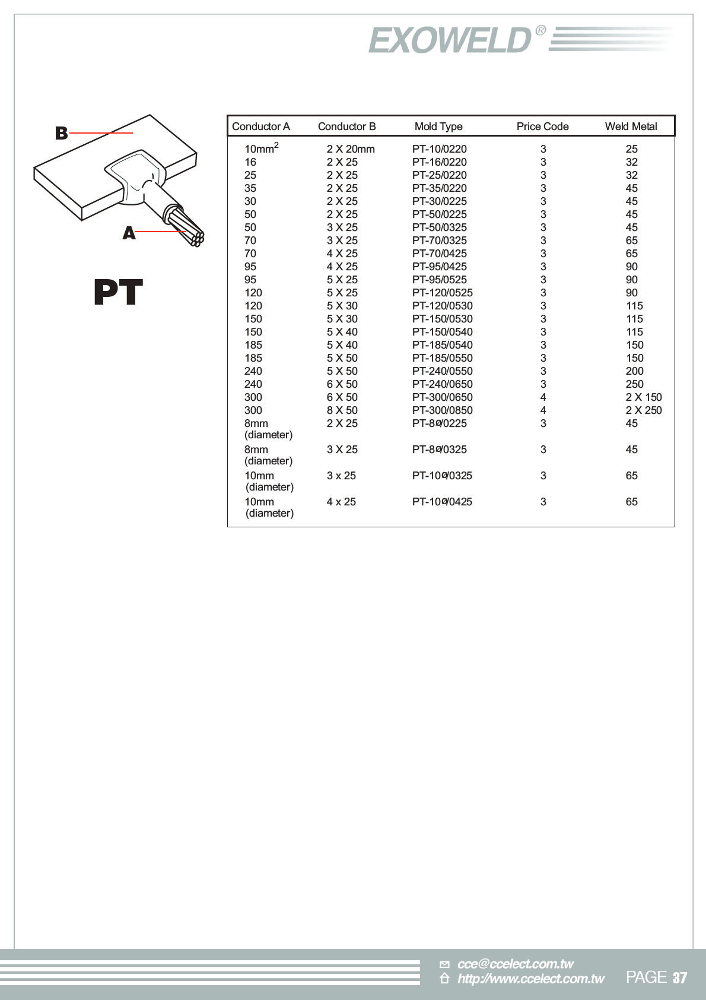](pages/page-37.png)
- 示意圖：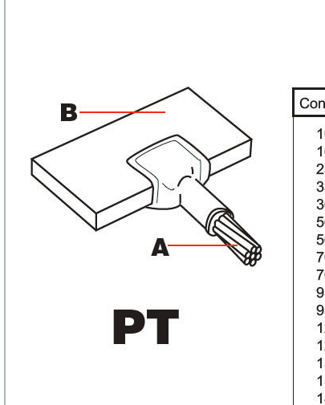

| 熔模型號 Mold Type | Price Code | Weld Metal | 配件 |
| --- | --- | --- | --- |
| `PT-10/0220` | 3 | 25 | — |
| `PT-16/0220` | 3 | 32 | — |
| `PT-25/0220` | 3 | 32 | — |
| `PT-35/0220` | 3 | 45 | — |
| `PT-30/0225` | 3 | 45 | — |
| `PT-50/0225` | 3 | 45 | — |
| `PT-50/0325` | 3 | 45 | — |
| `PT-70/0325` | 3 | 65 | — |
| `PT-70/0425` | 3 | 65 | — |
| `PT-95/0425` | 3 | 90 | — |
| `PT-95/0525` | 3 | 90 | — |
| `PT-120/0525` | 3 | 90 | — |
| `PT-120/0530` | 3 | 115 | — |
| `PT-150/0530` | 3 | 115 | — |
| `PT-150/0540` | 3 | 115 | — |
| `PT-185/0540` | 3 | 150 | — |
| `PT-185/0550` | 3 | 150 | — |
| `PT-240/0550` | 3 | 200 | — |
| `PT-240/0650` | 3 | 250 | — |
| `PT-300/0650` | 4 | 2X 150 | — |
| `PT-300/0850` | 4 | 2X 250 | — |
| `PT-890225` | 3 | 45 | — |
| `PT-890325` | 3 | 45 | — |
| `PT-10410325` | 3 | 65 | — |
| `PT-10910425` | 3 | 65 | — |


<a id="series-b"></a>

## B 系列 — 扁銅排連接（Busbar）

扁銅排對扁銅排、扁銅排對鋼結構。

### BE — 扁銅排對扁銅排

Busbar to busbar end

- 型錄頁：PAGE 38
- 整頁圖：[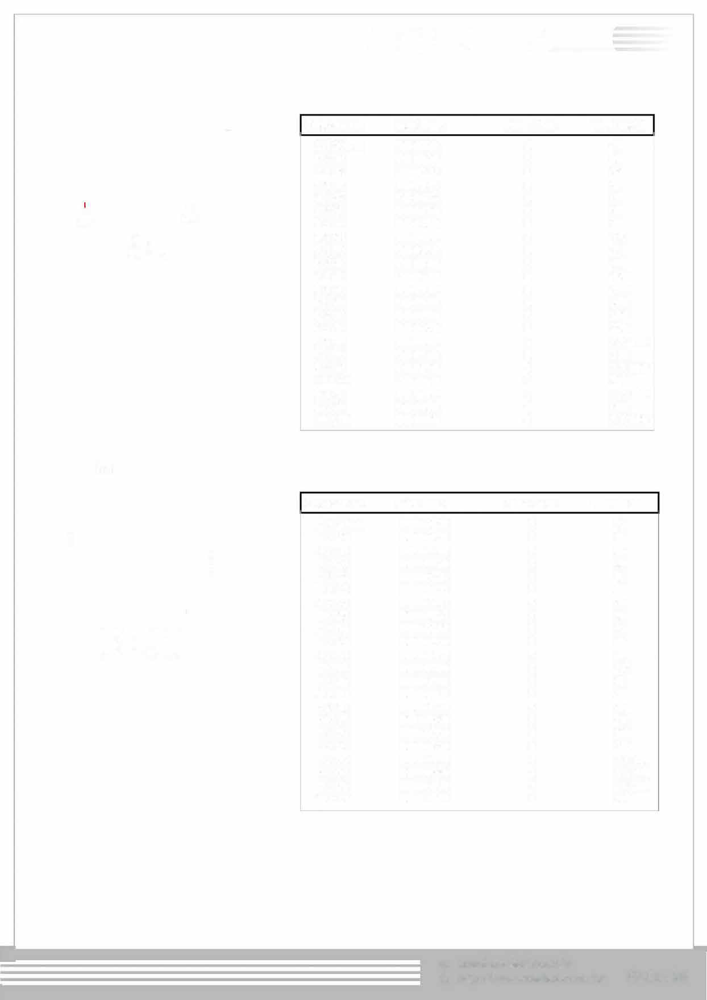](pages/page-38.png)
- 示意圖：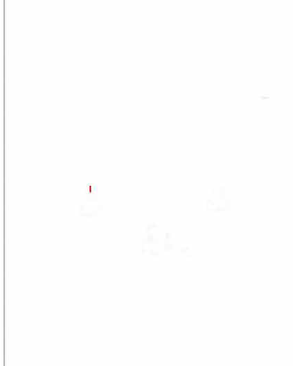

| 熔模型號 Mold Type | Price Code | Weld Metal | 配件 |
| --- | --- | --- | --- |
| `BE-0220` | 3 | 45 | — |
| `BE-0320` | 3 | 45 | — |
| `BE-0225` | 3 | 65 | — |
| `BE-0325` | 3 | 65 | — |
| `BE-0425` | 3 | 90 | — |
| `BE-0230` | 3 | 65 | — |
| `BE-0330` | 3 | 90 | — |
| `BE-0430` | 3 | 115 | — |
| `BE-0530` | 3 | 115 | — |
| `BE-0340` | 3 | 115 | — |
| `BE-0440` | 3 | 150 | — |
| `BE-0540` | 3 | 150 | — |
| `BE-0640` | 3 | 200 | — |
| `BE-0550` | 3 | 200 | — |
| `BE-0650` | 3 | 250 | — |
| `BE-0850` | 4 | 2X 150 | — |
| `BE-0660` | 3 | 250 | — |
| `BE-0860` | 4 | 2X200 | — |
| `BE-0680` | 4 | 2X200 | — |
| `BE-0880` | 4 | 500 | — |


### BEH — 扁銅排水平搭接

Busbar horizontal

- 型錄頁：PAGE 38
- 整頁圖：[](pages/page-38.png)
- 示意圖：

| 熔模型號 Mold Type | Price Code | Weld Metal | 配件 |
| --- | --- | --- | --- |
| `BEH-0220` | 3 | 45 | — |
| `BEH-0320` | 3 | 45 | — |
| `BEH-0420` | 3 | 65 | — |
| `BEH-0520` | 3 | 90 | — |
| `BEH-0225` | 3 | 45 | — |
| `BEH-0325` | 3 | 65 | — |
| `BEH-0425` | 3 | 90 | — |
| `BEH-0525` | 3 | 90 | — |
| `BEH-0230` | 3 | 65 | — |
| `BEH-0330` | 3 | 65 | — |
| `BEH-0430` | 3 | 90 | — |
| `BEH-0530` | 3 | 115 | — |
| `BEH-0340` | 3 | 65 | — |
| `BEH-0440` | 3 | 65 | — |
| `BEH-0540` | 3 | 90 | — |
| `BEH-0640` | 3 | 200 | — |
| `BEH-0550` | 4 | 200 | — |
| `BEH-0650` | 4 | 250 | — |
| `BEH-0850` | 4 | 2X 150 | — |
| `BEH-0660` | 4 | 2X 150 | — |
| `BEH-0860` | 4 | 2X200 | — |


### BTV — 扁銅排垂直 T

Busbar vertical T

- 型錄頁：PAGE 39
- 整頁圖：[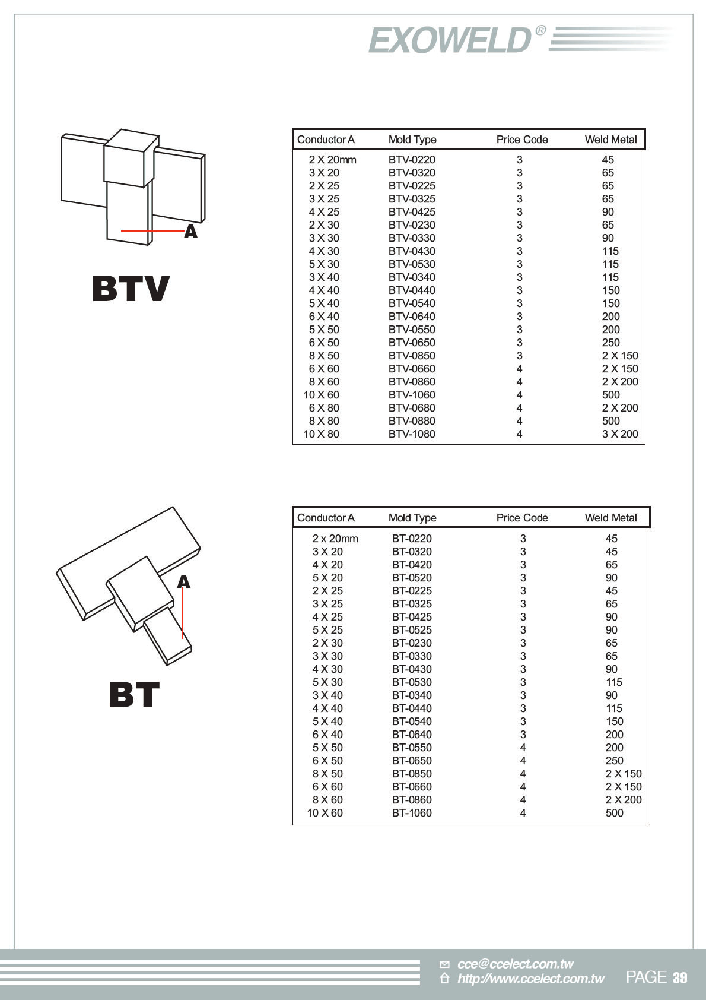](pages/page-39.png)
- 示意圖：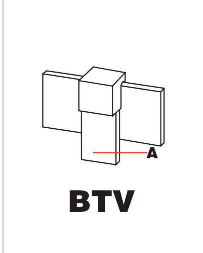

| 熔模型號 Mold Type | Price Code | Weld Metal | 配件 |
| --- | --- | --- | --- |
| `BTV-0220` | 3 | 45 | — |
| `BTV-0320` | 3 | 65 | — |
| `BTV-0225` | 3 | 65 | — |
| `BTV-0325` | 3 | 65 | — |
| `BTV-0425` | 3 | 90 | — |
| `BTV-0230` | 3 | 65 | — |
| `BTV-0330` | 3 | 90 | — |
| `BTV-0430` | 3 | 115 | — |
| `BTV-0530` | 3 | 115 | — |
| `BTV-0340` | 3 | 115 | — |
| `BTV-0440` | 3 | 150 | — |
| `BTV-0540` | 3 | 150 | — |
| `BTV-0640` | 3 | 200 | — |
| `BTV-0550` | 3 | 200 | — |
| `BTV-0650` | 3 | 250 | — |
| `BTV-0850` | 3 | 2X 150 | — |
| `BTV-0660` | 4 | 2X150 | — |
| `BTV-0860` | 4 | 2X 200 | — |
| `BTV-1060` | 4 | 500 | — |
| `BTV-0680` | 4 | 2X200 | — |
| `BTV-0880` | 4 | 500 | — |
| `BTV-1080` | 4 | 3X 200 | — |


### BS — 扁銅排對鋼結構

Busbar to steel

- 型錄頁：PAGE 40
- 整頁圖：[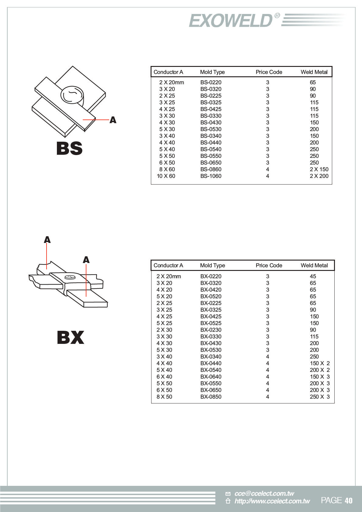](pages/page-40.png)
- 示意圖：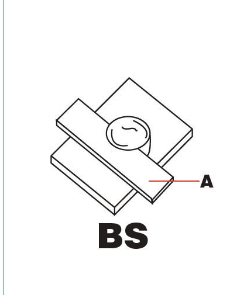

| 熔模型號 Mold Type | Price Code | Weld Metal | 配件 |
| --- | --- | --- | --- |
| `BS-0320` | 3 | 90 | — |
| `BS-0225` | 3 | 90 | — |
| `BS-0325` | 3 | 115 | — |
| `BS-0425` | 3 | 115 | — |
| `BS-0330` | 3 | 15 | — |
| `BS-0430` | 3 | 150 | — |
| `BS-0530` | 3 | 200 | — |
| `BS-0340` | 3 | 150 | — |
| `BS-0440` | 3 | 200 | — |
| `BS-0540` | 3 | 250 | — |
| `BS-0550` | 3 | 250 | — |
| `BS-0650` | 3 | 250 | — |
| `BS-0860` | 4 | 2X 150 | — |
| `BS-1060` | 4 | 2X 200 | — |


### BVSE — 扁銅排對鋼立面

Busbar to vertical steel

- 型錄頁：PAGE 41
- 整頁圖：[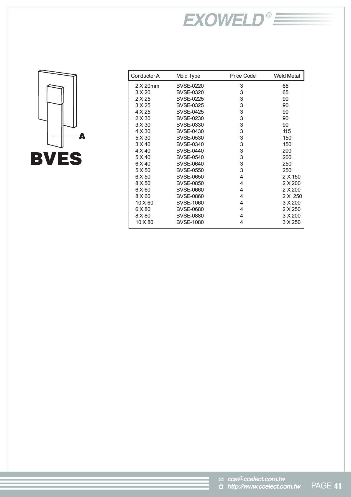](pages/page-41.png)
- 示意圖：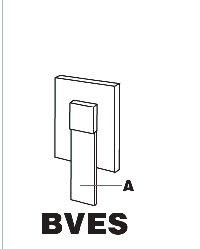

| 熔模型號 Mold Type | Price Code | Weld Metal | 配件 |
| --- | --- | --- | --- |
| `BVSE-0220` | 3 | 65 | — |
| `BVSE-0320` | 3 | 65 | — |
| `BVSE-0225` | 3 | 90 | — |
| `BVSE-0325` | 3 | 90 | — |
| `BVSE-0425` | 3 | 90 | — |
| `BVSE-0230` | 3 | 90 | — |
| `BVSE-0330` | 3 | 90 | — |
| `BVSE-0430` | 3 | 115 | — |
| `BVSE-0530` | 3 | 150 | — |
| `BVSE-0340` | 3 | 150 | — |
| `BVSE-0440` | 3 | 200 | — |
| `BVSE-0540` | 3 | 200 | — |
| `BVSE-0640` | 3 | 250 | — |
| `BVSE-0550` | 3 | 250 | — |
| `BVSE-0650` | 4 | 2X 150 | — |
| `BVSE-0850` | 4 | 2X 200 | — |
| `BVSE-0660` | 4 | 2X 200 | — |
| `BVSE-0860` | 4 | 2X 250 | — |
| `BVSE-1060` | 4 | 3X 200 | — |
| `BVSE-0680` | 4 | 2X 250 | — |
| `BVSE-0880` | 4 | 3X 200 | — |
| `BVSE-1080` | 4 | 3X 250 | — |


<a id="series-e"></a>

## E 系列 — 端子（Lugs / Terminals）

線端端子／耳片型熔模。

### ERB — 線端端子／耳片

Cable lug / terminal

- 型錄頁：PAGE 42
- 整頁圖：[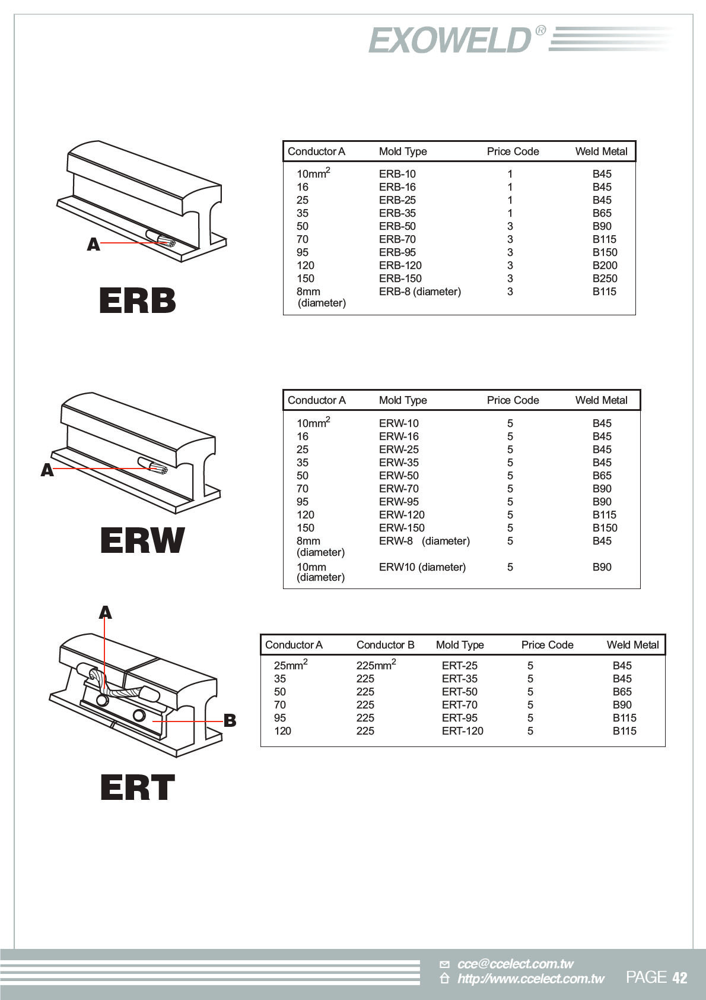](pages/page-42.png)
- 示意圖：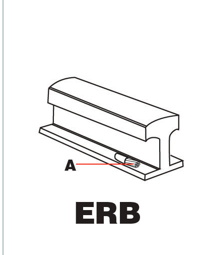

| 熔模型號 Mold Type | Price Code | Weld Metal | 配件 |
| --- | --- | --- | --- |
| `ERB-10` | 1 | B45 | — |
| `ERB-16` | 1 | B45 | — |
| `ERB-25` | 1 | B45 | — |
| `ERB-35` | 1 | B65 | — |
| `ERB-50` | 3 | B90 | — |
| `ERB-70` | 3 | B115 | — |
| `ERB-95` | 3 | B150 | — |
| `ERB-120` | 3 | B200 | — |
| `ERB-150` | 3 | B250 | — |


<a id="series-c"></a>

## C 系列 — 陰極防蝕（Cathodic Protection）

陰極防蝕專用熔接劑（CP）與對應熔模。

### CSHEA — 陰極防蝕鋼板對線

CP steel to cable

- 型錄頁：PAGE 43
- 整頁圖：[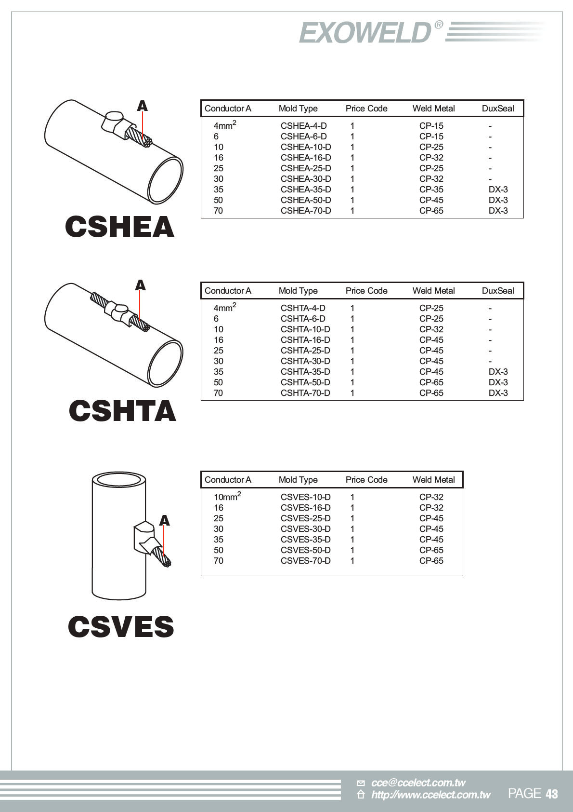](pages/page-43.png)
- 示意圖：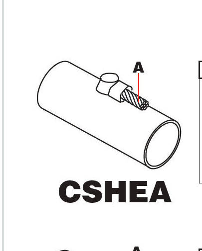

| 熔模型號 Mold Type | Price Code | Weld Metal | 配件 |
| --- | --- | --- | --- |
| `CSHEA-4-D` | 1 | CP-15 | — |
| `CSHEA-6-D` | 1 | CP-15 | — |
| `CSHEA-10-D` | 1 | CP-25 | — |
| `CSHEA-16-D` | 1 | CP-32 | — |
| `CSHEA-25D` | 1 | CP-25 | — |
| `CSHEA-30-D` | 1 | CP-32 | — |
| `CSHEA-35-D` | 1 | CP-35 | DX-3 |
| `CSHEA-50-D` | 1 | CP-45 | DX-3 |
| `CSHEA-70-D` | 1 | CP-65 | DX-3 |


### CWL — 陰極防蝕線對線 L

CP wire L

- 型錄頁：PAGE 44
- 整頁圖：[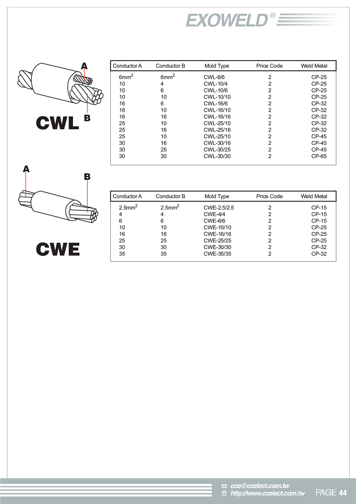](pages/page-44.png)
- 示意圖：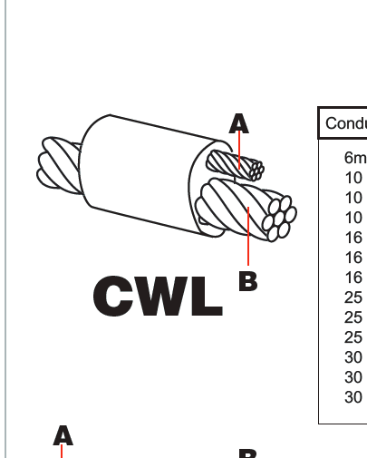

| 熔模型號 Mold Type | Price Code | Weld Metal | 配件 |
| --- | --- | --- | --- |
| `CWL-6/6` | 2 | CP-25 | — |
| `CWL-10/4` | 2 | CP-25 | — |
| `CWL-10/6` | 2 | CP-25 | — |
| `CWL-10/10` | 2 | CP-25 | — |
| `CWL-16/6` | 2 | CP-32 | — |
| `CWL-16/10` | 2 | CP-32 | — |
| `CWL-16/16` | 2 | CP-32 | — |
| `CWL-25/10` | 2 | CP-32 | — |
| `CWL-25/16` | 2 | CP-32 | — |
| `CWL-30/16` | 2 | CP-45 | — |
| `CWL-30/25` | 2 | CP-45 | — |
| `CWL-30/30` | 2 | CP-65 | — |


### CWE — 陰極防蝕線對線直通

CP wire through

- 型錄頁：PAGE 44
- 整頁圖：[](pages/page-44.png)
- 示意圖：

| 熔模型號 Mold Type | Price Code | Weld Metal | 配件 |
| --- | --- | --- | --- |
| `CWE-2.5/2.5` | 2 | CP-15 | — |
| `CWE-4/4` | 2 | CP-15 | — |
| `CWE-6/6` | 2 | CP-15 | — |
| `CWE-10/10` | 2 | CP-25 | — |
| `CWE-16/16` | 2 | CP-25 | — |
| `CWE-25/25` | 2 | CP-25 | — |
| `CWE-30/30` | 2 | cP-32 | — |
| `CWE-35/35` | 2 | CP-32 | — |


---

## 應用與其他產品

### Tech Tip：接地網材料與成本

主導體 ≥ 150 mm² 時，建議以約 **50 mm²** 中繼線連接主網與接地棒（取代直接大型 GET），可簡化施工並節省材料。

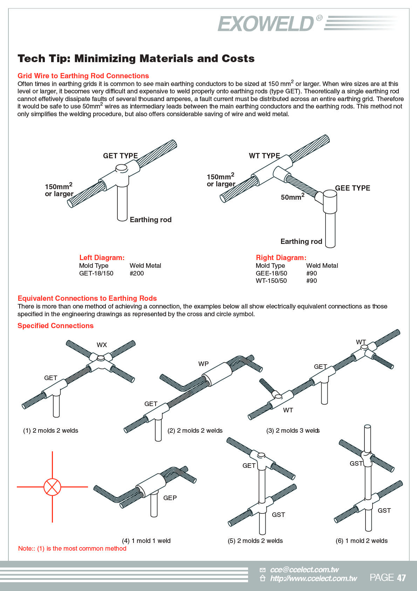

### Tectoweld Ground Plates

接地板 AG201（2 孔）／AG401（4 孔），可接受至約 100 mm² 導體，符合 NEMA／IEC。

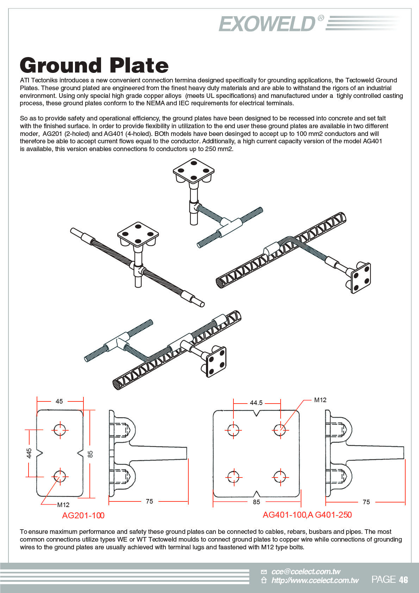

### Personnel Protection Safety Mesh

人員防護網（IEEE Std. 80-1986），標準約 1.5×1.5 m、1.5×2 m。

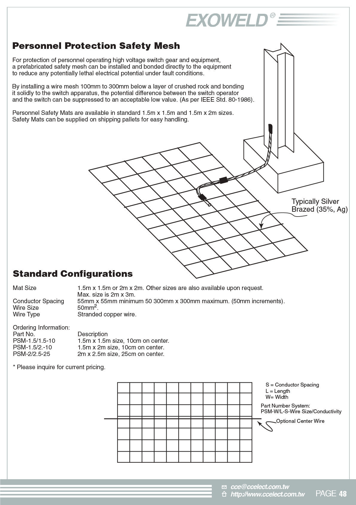

### Ionic Earthing Array

離子接地陣列：穩定低接地電阻解決方案。

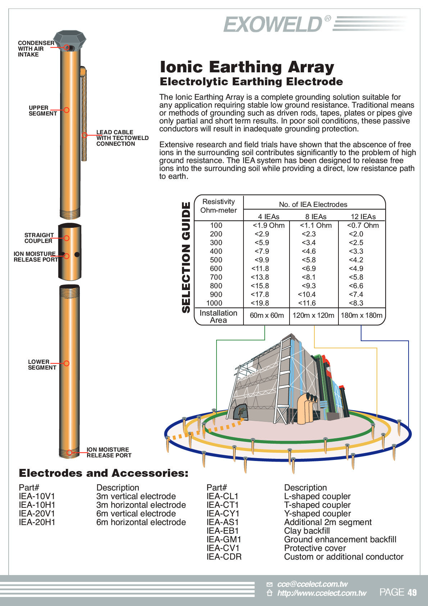

### 聯絡資訊

**CHI CHI Electric Company, Ltd**  
No. 2-2, Yun-Ho Street, Taipei, Taiwan  
TEL: (02) 2363-2992　FAX: (02) 2363-9044  
E-Mail: cce@ccelect.com.tw  

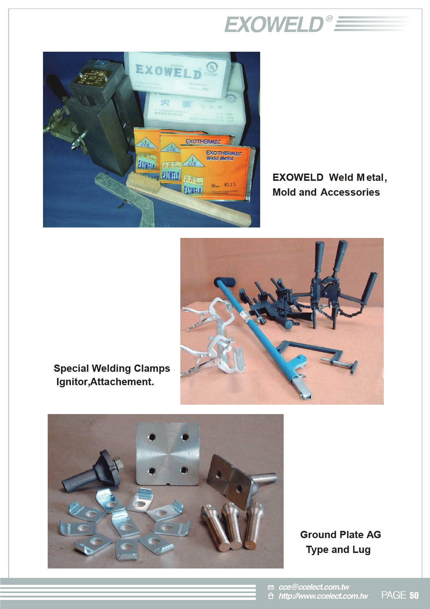

---

## 完整頁面圖片索引

| 頁碼 | 檔案 |
| --- | --- |

| 1 | [pages/page-01.png](pages/page-01.png) |
| 2 | [pages/page-02.png](pages/page-02.png) |
| 3 | [pages/page-03.png](pages/page-03.png) |
| 4 | [pages/page-04.png](pages/page-04.png) |
| 5 | [pages/page-05.png](pages/page-05.png) |
| 6 | [pages/page-06.png](pages/page-06.png) |
| 8 | [pages/page-08.png](pages/page-08.png) |
| 9 | [pages/page-09.png](pages/page-09.png) |
| 10 | [pages/page-10.png](pages/page-10.png) |
| 11 | [pages/page-11.png](pages/page-11.png) |
| 12 | [pages/page-12.png](pages/page-12.png) |
| 13 | [pages/page-13.png](pages/page-13.png) |
| 14 | [pages/page-14.png](pages/page-14.png) |
| 15 | [pages/page-15.png](pages/page-15.png) |
| 16 | [pages/page-16.png](pages/page-16.png) |
| 17 | [pages/page-17.png](pages/page-17.png) |
| 18 | [pages/page-18.png](pages/page-18.png) |
| 19 | [pages/page-19.png](pages/page-19.png) |
| 20 | [pages/page-20.png](pages/page-20.png) |
| 21 | [pages/page-21.png](pages/page-21.png) |
| 22 | [pages/page-22.png](pages/page-22.png) |
| 23 | [pages/page-23.png](pages/page-23.png) |
| 24 | [pages/page-24.png](pages/page-24.png) |
| 25 | [pages/page-25.png](pages/page-25.png) |
| 26 | [pages/page-26.png](pages/page-26.png) |
| 27 | [pages/page-27.png](pages/page-27.png) |
| 28 | [pages/page-28.png](pages/page-28.png) |
| 29 | [pages/page-29.png](pages/page-29.png) |
| 30 | [pages/page-30.png](pages/page-30.png) |
| 31 | [pages/page-31.png](pages/page-31.png) |
| 32 | [pages/page-32.png](pages/page-32.png) |
| 33 | [pages/page-33.png](pages/page-33.png) |
| 34 | [pages/page-34.png](pages/page-34.png) |
| 35 | [pages/page-35.png](pages/page-35.png) |
| 36 | [pages/page-36.png](pages/page-36.png) |
| 37 | [pages/page-37.png](pages/page-37.png) |
| 38 | [pages/page-38.png](pages/page-38.png) |
| 39 | [pages/page-39.png](pages/page-39.png) |
| 40 | [pages/page-40.png](pages/page-40.png) |
| 41 | [pages/page-41.png](pages/page-41.png) |
| 42 | [pages/page-42.png](pages/page-42.png) |
| 43 | [pages/page-43.png](pages/page-43.png) |
| 44 | [pages/page-44.png](pages/page-44.png) |
| 45 | [pages/page-45.png](pages/page-45.png) |
| 46 | [pages/page-46.png](pages/page-46.png) |
| 47 | [pages/page-47.png](pages/page-47.png) |
| 48 | [pages/page-48.png](pages/page-48.png) |
| 49 | [pages/page-49.png](pages/page-49.png) |
| 50 | [pages/page-50.png](pages/page-50.png) |
| 51 | [pages/page-51.png](pages/page-51.png) |

---

## 檔案結構

```
docs/exoweld-iec-catalog/
├── README.md       ← 本整理文件
├── products.json   ← 結構化規格（機器可讀）
├── pages/          ← 整頁型錄圖 page-XX.png
└── products/       ← 接點示意裁切 page-XX-diagram.png
```

中間產物（原始 OCR、擷取腳本）在 `docs/exoweld-catalog-extract/`。
